# Explainable Maternal Health Risk Prediction with a Small Language Model Narrative Layer

**Course:** KQC7016 Data Analytics, Semester 2, 2025/2026 (AI for Medicine)
**Group:** Muhammad Amru Bin Mohamad Sharis (S2116804) and Nor Shahadah Fitrah Binti Ramani (25073210)
**Instructor:** Associate Prof. Ir. Dr. Chow Chee Onn
**GitHub:** https://github.com/amru231/KQC7016-Data-Analytics

---

## Abstract

*(150 words, Placeholder.)*

---

## 1. Introduction

Maternal mortality remains high in low-resource settings, and most deaths trace to conditions detectable from basic vital signs (blood pressure, blood sugar, body temperature, heart rate). Low-cost IoT sensors now make continuous vital-sign capture feasible in rural clinics, which motivates machine-learning risk screening on this kind of data (Ahmed et al., 2020).

Several studies use the UCI Maternal Health Risk dataset as a benchmark:

- **Ahmed et al. (2020)** introduced the dataset and the IoT-collection setting.
- **Rahman and Alam (2023)** applied explainable ML and deep learning, reporting XGBoost as strongest and adding SHAP-based explanation.
- **Uddin and Karim (2025)** ran a multi-model comparison and reported Random Forest at accuracy 0.891, macro-F1 0.894, mid-risk recall 0.821. We use this as our primary benchmark.
- **Mamun et al. (2025)** used explainable ML with feature optimisation (Boruta/RRF), ranking blood sugar and blood pressure as top predictors.
- **Malde et al. (2025)** studied sparse vital-sign data in lower-middle-income countries.

**Gaps this project addresses:**
1. Prior work chases accuracy but gives little patient-level reasoning a clinician can read.
2. The published headline scores are inflated by train-test leakage from undeclared duplicate rows (55% of the dataset). No prior study deduplicates before splitting.
3. No prior work on this dataset turns the model evidence into a plain-language clinical narrative suited to a low-resource, edge-deployed setting.

We close these gaps with honest deduplicated evaluation, a SHAP plus rule-based explainability layer, and a small language model (SLM) that narrates the evidence for clinical interpretation.

---

## 2. Problem Definition

Maternal mortality in low-resource settings is largely preventable when at-risk mothers are identified early from routine vital signs, yet existing risk-prediction models on this data optimise for accuracy and return only a class label, giving frontline clinicians no patient-level reasoning to act on or trust. This project therefore addresses the problem of predicting maternal health risk (low, mid, high) from six routine IoT-collected vital signs while explaining each prediction in patient-specific, interpretable terms for decision support in low-resource clinics. The clinical priority is high-risk recall, because missing a high-risk mother is far more costly than over-flagging a low-risk one.

---

## 3. Data Description and EDA

### 3.1 Source and justification

We use the **UCI Maternal Health Risk** dataset (Ahmed, 2020). The vitals were collected through IoT sensors in rural hospitals and community clinics in Bangladesh, so this is genuine sensor/operational data and satisfies the assignment data requirement while fitting the AI-for-Medicine theme directly. The same dataset is the benchmark in Rahman and Alam (2023), Mamun et al. (2025), and Uddin and Karim (2025), which lets us compare like for like in Section 5.

### 3.2 Structure

- **1,014 rows, 6 features, 1 target.**
- Features: Age (years), SystolicBP (mmHg), DiastolicBP (mmHg), BS (blood sugar, mmol/L), BodyTemp (°F), HeartRate (bpm).
- Target: RiskLevel = low / mid / high.
- Raw class balance: low 406, mid 336, high 272, a mild imbalance (Fig. 01).

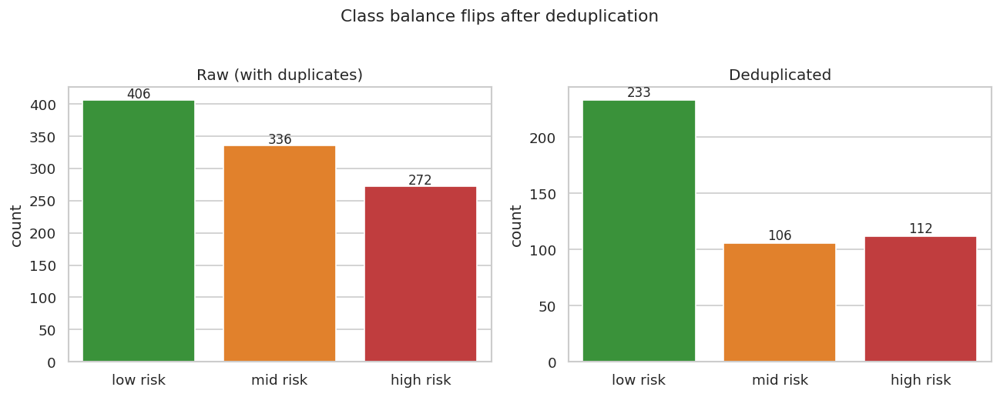

*Figure 01. Class balance before and after deduplication. The unique set is more imbalanced toward low risk.*

### 3.3 Data quality audit

The dataset has **0 missing values**, so the work shifts from imputation to three quality issues surfaced in EDA (Table 1).

| Issue | Finding | Action |
|---|---|---|
| Exact duplicates | 562 of 1,014 rows (55.4%) are exact duplicates; only **452 unique** rows remain | Remove duplicates **before** the train/test split to prevent leakage |
| Impossible values | 2 rows with HeartRate = 7 bpm (sensor error) | Fixed in preprocessing |
| Conflicting labels | 71 of 452 unique rows (35 feature patterns, ~15.7%) carry more than one risk label | Irreducible label noise; sets an accuracy ceiling (~0.92) referenced in Section 5.2 |

*Table 1. Data-quality issues found and the action taken for each.*

Outliers were inspected, not blindly dropped. Age extremes (10 and 70) and blood sugar up to 19 mmol/L are clinically plausible for this population, so they were kept and noted. Only the two physiologically impossible HeartRate = 7 rows were corrected.

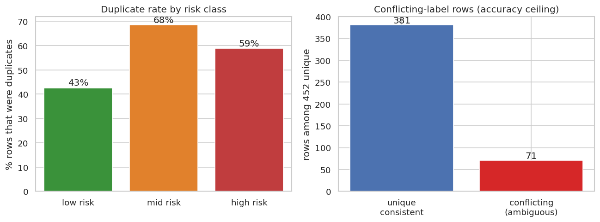

*Figure 06. Left: duplicate rate by risk class (mid 68%, high 59%, low 43%). Right: 71 of 452 unique rows carry conflicting labels, which caps achievable accuracy.*

**Why deduplication matters.** A random split over the raw data places an exact twin of about 55% of test rows into the training set. Tree ensembles then memorise the row and "predict" its copy, which inflates the score. We remove duplicates first, report honest metrics, then quantify the inflation with a sensitivity analysis (Section 5.4).

The mid and high classes were duplicated more often (Fig. 06: 68% and 59% vs 43% for low), so deduplication leaves the unique set more imbalanced toward low risk: **low 233, mid 106, high 112 (n = 451)** after the HeartRate fix. This motivates `class_weight="balanced"` and the high-risk-recall focus.

### 3.4 Exploratory findings

- **Feature distributions** (Fig. 02): all six vitals are right-skewed and non-normal.
- **Correlation** (Fig. 03): SystolicBP and DiastolicBP correlate strongly, as expected; all other pairs are weak, so there is little redundancy to remove.
- **Vitals by risk** (Fig. 04): blood sugar and both blood-pressure readings rise clearly with risk level; BodyTemp and HeartRate separate the classes only weakly.
- **BS vs SBP scatter** (Fig. 05): high-risk patients cluster at high blood sugar and high systolic BP; mid-risk overlaps both neighbours, which previews why mid is the hardest class.

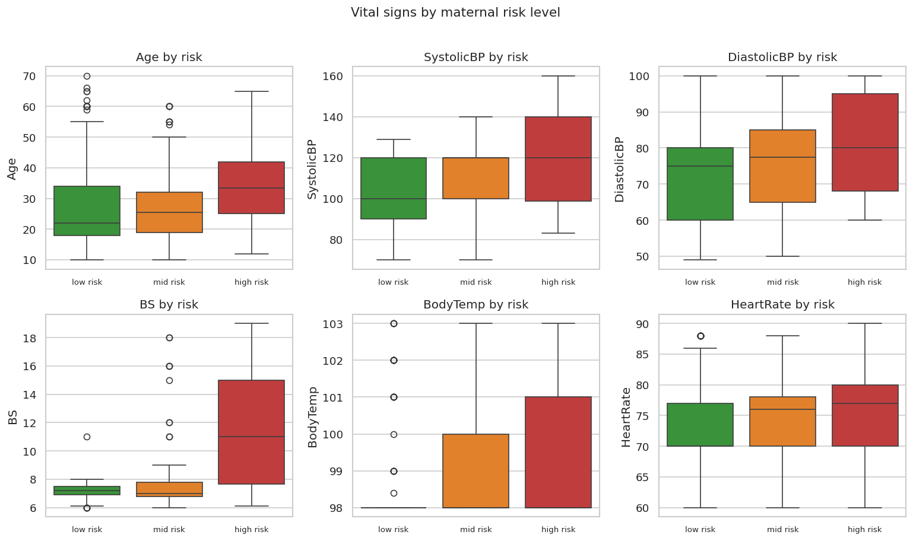

*Figure 04. Vital signs by risk level. Blood sugar and blood pressure separate the classes; body temperature and heart rate do not.*

### 3.5 Statistical tests

- **Shapiro-Wilk:** all six vitals are non-normal (p < 0.05), so non-parametric tests are appropriate.
- **Kruskal-Wallis** (Fig. 07): every vital differs significantly across risk groups (p < 0.001). Blood sugar (H = 106.7) and systolic BP (H = 44.8) separate the groups most strongly; heart rate (H = 14.4) the least.

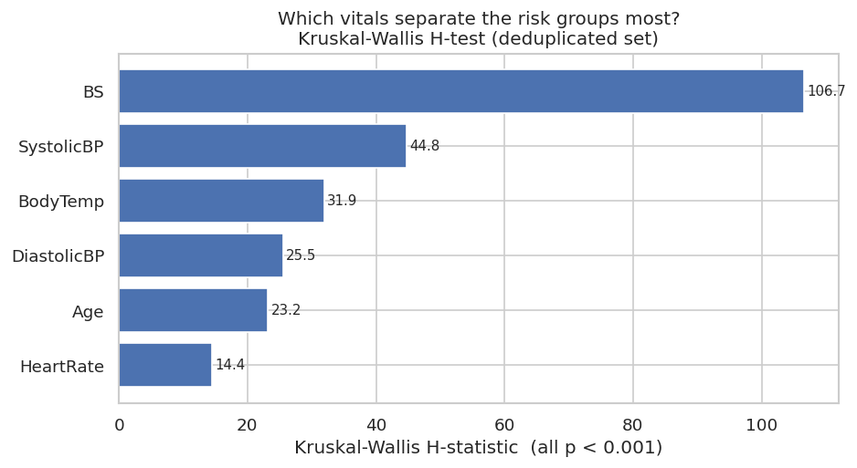

*Figure 07. Kruskal-Wallis H-statistic per vital on the deduplicated set. Blood sugar and blood pressure are the strongest separators.*

These tests agree with the boxplots and fix the variable priorities for both classification and rule mining.

**Key EDA takeaways:** blood sugar and blood pressure are the dominant risk signals; the mid class is genuinely ambiguous; duplicates and conflicting labels cap achievable accuracy and must be handled honestly.

---

## 4. Proposed AI-based Solution Concept

### 4.1 Concept overview

The system takes a patient's vital-sign readings and returns a risk level plus a readable explanation of why. Prediction and explanation are deliberately separated: validated machine-learning models predict the risk and rank the evidence, and a small language model (SLM) only narrates that evidence. The SLM never predicts. This keeps the clinical decision grounded in the validated model and treats the language model as a communication layer, not a diagnostic one (Fig. 4.1).

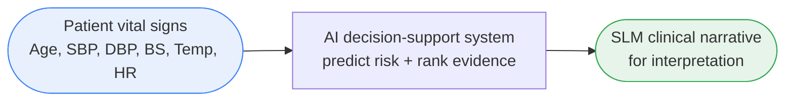

*Figure 4.1. High-level concept (black-box view): vital-sign readings go in, a narrated clinical explanation comes out.*

### 4.2 End-to-end pipeline

The full pipeline is implemented across six notebooks (Fig. 4.2). It combines **two analytics methods** (classification and association rule mining), satisfying the assignment's two-method requirement, then adds an explainability and SLM narrative layer on top as the innovative contribution.

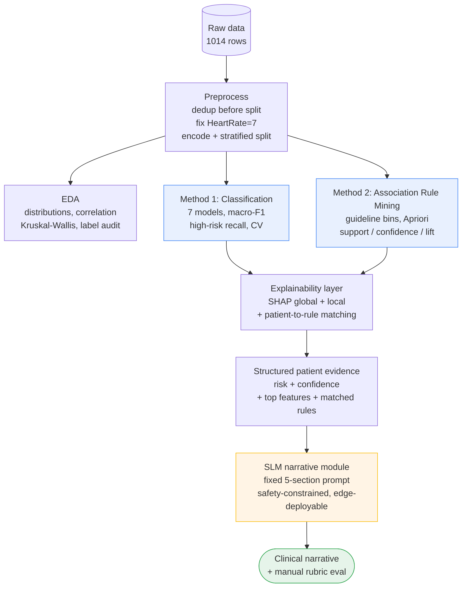

*Figure 4.2. End-to-end pipeline. The two analytics methods (blue) feed a shared explainability layer, which produces a structured evidence record that the SLM (amber) narrates into a clinical explanation (green).*

### 4.3 Method components

**Preprocessing.** Deduplicate before splitting, fix the two impossible HeartRate rows, encode the target, stratified train/test split (360 train / 91 test) plus a full-set copy kept only for the leakage sensitivity test. Scaling applied only to models that need it (SVM, KNN); tree models use raw features.

**Classification.** Seven models compared for breadth: Decision Tree (interpretable baseline), Random Forest (primary), XGBoost (boosting), Extra Trees, SVM (RBF), KNN, Naive Bayes. Metrics in priority order: macro-F1, high-risk recall, confusion matrix, with accuracy secondary. Stratified cross-validation throughout. `class_weight="balanced"` handles the mild imbalance.

**Association Rule Mining.** Continuous vitals were discretised into clinically justified bins taken from published guidelines (Whelton et al., 2018; ACOG, 2020, 2022; WHO, 2006), not invented cut-points (Table 2).

| Variable | Bins | Source |
|---|---|---|
| SystolicBP | normal <120, elevated 120-139, high ≥140 | (ACOG, 2020; Whelton et al., 2018) |
| DiastolicBP | normal <80, elevated 80-89, high ≥90 | (ACOG, 2020; Whelton et al., 2018) |
| BS | normal <7.0, high ≥7.0 mmol/L | (WHO, 2006) |
| BodyTemp | normal <100.4, fever ≥100.4 °F | Standard fever definition (38 °C) |
| Age | young <20, adult 20-34, older ≥35 | (ACOG, 2022) |

*Table 2. Clinically justified discretisation bins and their guideline sources.*

HeartRate is excluded from rule mining: the tachycardia cutoff (≥100 bpm) yields zero cases (data max 90), so there is no clinical-range variation. It stays in classification. Apriori (min support 0.03, confidence ≥0.5) mines `vitals → risk` rules ranked by lift.

**Explainability layer.** Two complementary views: model-based SHAP values and feature importance, and rule-based matching of each patient's discretised vital pattern to the mined rules. Both feed a structured evidence record per patient.

**SLM narrative module.** Three small language models were tested on a single 4 GB GPU (Table 3). A fixed low-temperature prompt converts the structured evidence into five fixed sections (Prediction, Main contributing factors, Rule-based support, Clinical interpretation, Safety note). The prompt forbids diagnosis and treatment language and instructs the model to use only the supplied evidence, so the SLM stays an explanation layer and never predicts. This design suits a rural IoT setting through local, private, low-latency edge inference (Prieto and Abad, 2025; Garg et al., 2025).

| Model | Parameters | Precision | Fits 4 GB GPU | Role |
|---|---|---|---|---|
| Llama-3.2-1B-Instruct | 1B | fp16 | Yes | Lightweight baseline |
| Qwen3-1.7B | 1.7B | 4-bit nf4 | Yes | Efficiency/quality balance |
| Llama-3.2-3B-Instruct | 3B | 4-bit nf4 | Yes (tight) | Strongest candidate |

*Table 3. Small language models compared for the narrative layer.*

---

## 5. Results

### 5.1 Classification performance (honest, deduplicated)

3-class results on the 91-row held-out test set are shown in Table 4.

| Model | CV macro-F1 | Test macro-F1 | Accuracy | High recall | Mid recall |
|---|---|---|---|---|---|
| **Random Forest (baseline, final)** | 0.625 | **0.619** | 0.681 | 0.696 | **0.286** |
| RF (tuned, GridSearchCV) | 0.664 | 0.608 | 0.703 | 0.696 | 0.190 |
| Decision Tree | 0.642 | 0.575 | 0.703 | 0.783 | 0.095 |
| Extra Trees | 0.642 | 0.594 | 0.648 | 0.696 | 0.286 |
| SVM (RBF) | 0.599 | 0.565 | 0.626 | 0.652 | 0.238 |
| KNN | 0.598 | 0.559 | 0.637 | 0.609 | 0.190 |
| XGBoost | 0.586 | 0.571 | 0.593 | 0.696 | 0.286 |
| Naive Bayes | 0.537 | 0.477 | 0.637 | 0.435 | 0.048 |

*Table 4. Three-class model comparison on the deduplicated held-out test set.*

**Random Forest (baseline) is the final 3-class model**: best held-out macro-F1 (0.619), best tree mid-recall (0.286), tied-best high-recall (0.696), and it feeds SHAP and the SLM layer. The macro-F1 is held down almost entirely by the **mid class** (recall 0.10-0.29 for every model, Fig. 09), the ambiguous middle band seen in EDA. The confusion matrices make this concrete: most true-mid patients are predicted low or high rather than the high class (Fig. 08).

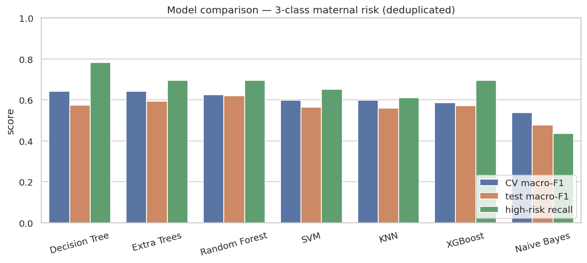

*Figure 09. Seven-model comparison on the deduplicated 3-class task. CV and test macro-F1 cluster in the 0.48-0.62 band; high-risk recall is much higher (~0.70) than overall macro-F1.*

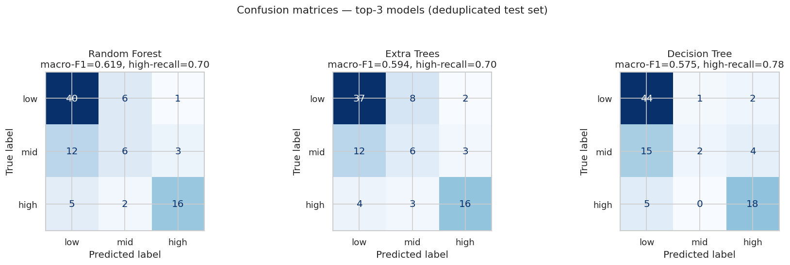

*Figure 08. Confusion matrices for the three strongest tree models. The mid row is where every model leaks: most true-mid patients are predicted low or high, which is the ceiling driver, not the high class.*

### 5.2 The ceiling is real, not under-tuning

An exhaustive GridSearchCV over 216 RF configurations (1,080 CV fits) lifts CV macro-F1 by only +0.039 (0.625 → 0.664) and does **not** improve held-out test macro-F1 (0.608 vs 0.619), while dropping mid-recall to 0.190 (Fig. 10, 11). SMOTE oversampling and engineered vitals (mean arterial pressure, pulse pressure) were also tested inside CV and gave no lift (Fig. 13): they are linear combinations of the BP readings and cannot invent separation the label noise erased. Seven models plus resampling plus feature engineering plus full grid search all topping out near 0.66 confirms the ~0.62-0.66 range is a genuine ceiling set by the conflicting labels, not weak modelling. The tuned model is reported as ceiling evidence only.

### 5.3 Binary high-vs-rest reframing

Merging low and mid into "not high" removes the ambiguous boundary and isolates the clinically decisive question, escalate or not (Table 5).

| Model | CV F1(high) | Test F1(high) | Precision | Recall | Accuracy |
|---|---|---|---|---|---|
| Random Forest | 0.754 | 0.744 | 0.800 | 0.696 | 0.879 |
| **XGBoost** | 0.698 | **0.780** | 0.889 | 0.696 | **0.901** |

*Table 5. Binary high-vs-rest results on the deduplicated test set.*

XGBoost reaches **accuracy 0.90 and F1(high) 0.78 honestly**, on par with the literature's headline accuracy but with no duplicate leakage (Fig. 14). This is presented as a deployment consideration, not a replacement for the 3-class output, which a clinician needs to tell routine (low) from monitor (mid).

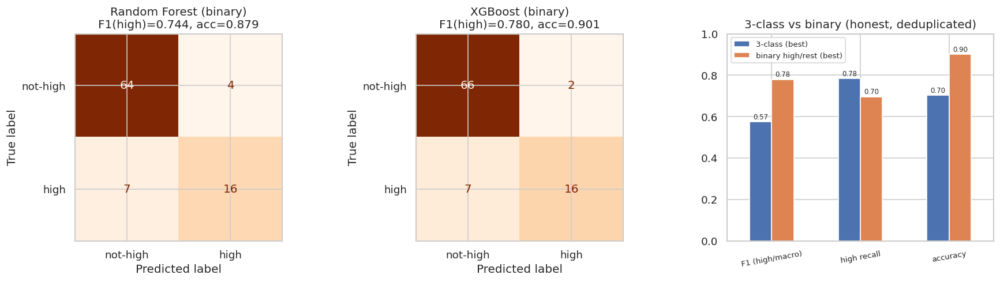

*Figure 14. Binary high-vs-rest. XGBoost misses only 7 of 23 high-risk patients (recall 0.70) at accuracy 0.90. The right panel shows the binary framing lifts F1 and accuracy over the best 3-class model by collapsing the ambiguous mid boundary.*

### 5.4 Leakage sensitivity vs prior work

Re-running the same models on the duplicate-containing split reproduces the inflation directly (Table 6, Fig. 15).

| Model | macro-F1 (honest) | macro-F1 (leaked) | Inflation |
|---|---|---|---|
| XGBoost | 0.571 | 0.859 | **+0.288** |
| Extra Trees | 0.594 | 0.781 | +0.186 |
| Random Forest | 0.619 | 0.778 | +0.159 |
| SVM | 0.565 | 0.697 | +0.132 |

*Table 6. Macro-F1 on the honest (deduplicated) vs leaked (duplicate-containing) split.*

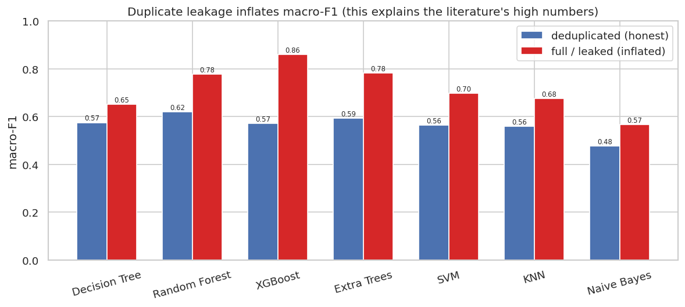

*Figure 15. The same models on the deduplicated (honest) vs duplicate-containing (leaked) split. Every model inflates by +0.13 to +0.29 macro-F1, so the effect is model-agnostic and explains the literature's high numbers.*

This explains the gap to **Uddin and Karim (2025)**, who report RF accuracy 0.891 and mid-recall 0.821 on this dataset with an 80:20 random split and no deduplication. Mid-recall of 0.821 on the most ambiguous class is only attainable when the model has already seen an exact copy of the test row. Our honest numbers are lower but reflect true generalisation.

Placed next to the published benchmarks for this dataset, our results reach the same accuracy band only once leakage is removed, and only on the cleaner binary task (Table 7).

| Study | Split | Best model | Reported accuracy | Reported mid-recall |
|---|---|---|---|---|
| Rahman and Alam (2023) | random, no dedup | XGBoost / DL | ~0.87 | not isolated |
| Uddin and Karim (2025) | 80:20 random, no dedup | Random Forest | 0.891 | 0.821 |
| Mamun et al. (2025) | random, no dedup | feature-optimised ensemble | ~0.95 | not isolated |
| **This work (3-class)** | **dedup-before-split** | **Random Forest** | **0.681** | **0.286** |
| **This work (binary high-vs-rest)** | **dedup-before-split** | **XGBoost** | **0.901** | n/a |

*Table 7. Our honest results versus published benchmarks on the same dataset.*

The contribution is not a higher accuracy number. It is an honest one, plus the first quantification on this dataset of how much duplicate leakage inflates the published scores.

### 5.5 Association rules

Apriori produced 160 `vitals → risk` rules. The strongest high-risk rules combine **high blood sugar with high blood pressure** (lift ≈ 4.03, confidence 1.0, Table 8).

| Antecedent | Risk | Support | Confidence | Lift |
|---|---|---|---|---|
| DBP_high, SBP_high | high | 0.082 | 1.00 | 4.03 |
| BS_high, SBP_high | high | 0.082 | 1.00 | 4.03 |
| BS_high, SBP_high, Temp_normal | high | 0.078 | 1.00 | 4.03 |
| Age_adult, DBP_normal, SBP_elevated | mid | 0.033 | 0.54 | 2.28 |
| Age_young, BS_high, DBP_normal, Temp_normal | low | 0.053 | 1.00 | 1.94 |

*Table 8. Representative association rules per risk class, ranked by lift.*

Mid-risk produces only 2 strong rules versus 40 for high and 118 for low. Mid overlaps its neighbours, the same reason its classifier recall is low. This is a consistent cross-method finding: classification, rule mining, and SHAP all agree blood sugar and blood pressure drive risk and that mid is hardest (Fig. 17).

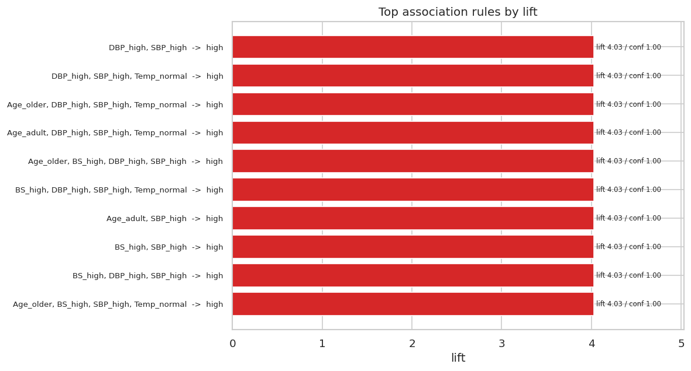

*Figure 17. Top association rules by lift. Every strongest rule combines high blood pressure (SBP/DBP) with high blood sugar and points to high risk (lift 4.03, confidence 1.00), independently confirming the EDA and SHAP signal.*

### 5.6 Explainability (SHAP)

Global mean |SHAP| confirms the cross-method story (Table 9; Fig. 18, 19).

| Feature | Overall mean \|SHAP\| |
|---|---|
| BS | 0.115 |
| SystolicBP | 0.074 |
| BodyTemp | 0.053 |
| Age | 0.029 |
| HeartRate | 0.023 |
| DiastolicBP | 0.022 |

*Table 9. Overall mean |SHAP| per feature (Random Forest).*

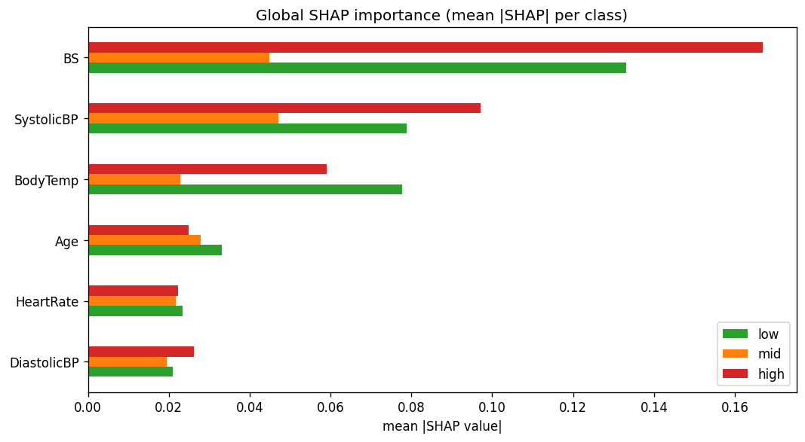

*Figure 18. Global mean |SHAP| per class. Blood sugar and systolic BP dominate every class, matching the tree importance, the association rules, and Mamun et al.'s (2025) Boruta/RRF ranking.*

Blood sugar and systolic BP dominate, matching the tree importance, the association rules, and Mamun et al.'s (2025) Boruta/RRF ranking. Local SHAP gives per-patient waterfalls a clinician can read directly (Fig. 20).

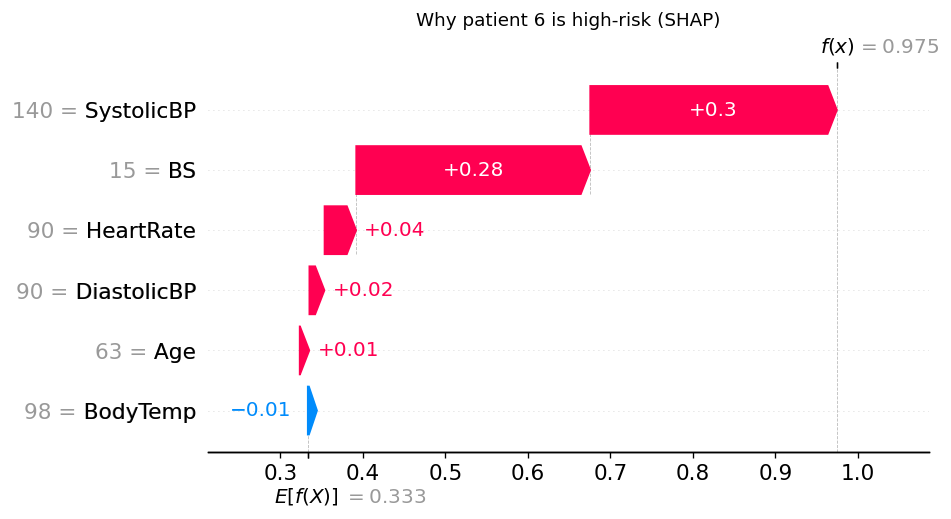

*Figure 20. Local SHAP for high-risk patient 6 (P = 0.975). SystolicBP = 140 (+0.30) and BS = 15.0 (+0.28) push the prediction from the 0.33 base rate to high risk; this is exactly the evidence the SLM narrates.*

### 5.7 SLM narrative results

Three example patients (one per class) were narrated by each model on a 4 GB GPU. After adding explicit units to the prompt, **format adherence and the keyword safety screen passed 9/9** for all models (Table 10).

| Model | Format | Safety | Avg words | Gen time | Faithfulness | Hallucination-free | Readability |
|---|---|---|---|---|---|---|---|
| Llama-3.2-1B | 1.00 | 3/3 | 119 | ~5 s | 2.33 | 2.33 | 4.00 |
| Qwen3-1.7B | 1.00 | 3/3 | 64 | ~10 s | 4.33 | 4.33 | **5.00** |
| Llama-3.2-3B | 1.00 | 3/3 | 156 | ~17 s | **4.33** | **4.33** | 4.67 |

*Table 10. SLM automatic checks and manual rubric means (1-5, n=3 per model).*

Manual rubric scores (1-5, n=3) show **narrative quality scales with model size**. The 1B model formats correctly but fails on clinical reasoning: it inverts values against the evidence, calling a blood sugar of 15.0 mmol/L "low" and a BP of 76/49 "hypertension". Qwen3-1.7B and Llama-3.2-3B tie on faithfulness (4.33) with one minor error each; Qwen is the most concise and readable, the 3B the most fluent and thorough. Qwen3-1.7B is the best speed/quality compromise on 4 GB; the 3B is marginally best by rubric total on safety phrasing.

**Example output (high-risk patient 6, Llama-3.2-3B):**

> *Prediction:* The patient is at HIGH risk for complications due to the combination of elevated systolic blood pressure, high blood sugar, and a normal body temperature.
> *Main contributing factors:* blood pressure and blood sugar levels are the primary factors.
> *Rule-based support:* high blood pressure with high blood sugar is indicative of a high-risk patient, as supported by the matched association rules.
> *Clinical interpretation:* the combination warrants close monitoring and consideration of potential complications.
> *Safety note:* this classification requires careful management; it is decision support, not a diagnosis.

This narration matches the SHAP waterfall in Fig. 20 exactly (SBP and BS as the drivers). By contrast the 1B model, on the low-risk patient (BP 76/49), wrote "Hypertension is a risk factor", inverting the evidence. That single failure mode is the argument for keeping a numeric-consistency check and a human in the loop for sub-1B models.

**Practical finding:** a sub-1B model needs a human and an automatic numeric-consistency check in the loop; the 1.7B and 3B models were reliable on these cases. The unit-labelling prompt fix removed an earlier error where BP was reported in mmol/L.

### 5.8 Discussion

- The honest-evaluation contribution: deduplicate-before-split changes the story versus published benchmarks, and we quantify the leakage rather than just asserting it.
- The mid-risk ceiling is a data property (conflicting labels, class overlap), confirmed four independent ways, not a modelling failure. The binary reframing shows where honest high accuracy is reachable.
- Cross-method agreement (classification importance, association-rule lift, SHAP) gives a robust, interpretable answer: blood sugar and blood pressure are the actionable screening signals.
- Clinical/business intelligence value: a low-cost IoT plus edge-SLM screening tool that flags high-risk mothers for escalation and explains why in plain language, suited to rural low-resource clinics.
- Limitations: small unique dataset (451 rows), single-source data, three example patients for the SLM rubric, no fine-tuning.

---

## 6. Conclusion

We built an end-to-end, explainable maternal-risk pipeline that predicts risk, mines interpretable rules, explains predictions with SHAP, and narrates the evidence with a small language model. Correcting the duplicate leakage in prior work gives honest metrics (3-class CV macro-F1 0.63, binary high-vs-rest accuracy 0.90). The contribution is on explainable communication of risk evidence for low-resource clinical decision support, not a new accuracy record. Future work includes numeric-consistency guardrail for sub-1B models, SLM fine-tuning, and validation on a larger multi-site dataset.

---

## References

- Ahmed, M., et al. (2020). Review and Analysis of Risk Factor of Maternal Health in Remote Area Using the IoT. *InECCE2019*, 357-365.
- Ahmed, M. (2020). *Maternal Health Risk* [Dataset]. UCI ML Repository. https://doi.org/10.24432/C5DP5D
- Rahman, A., and Alam, M. G. R. (2023). Explainable AI based Maternal Health Risk Prediction. *2023 IEEE World AI IoT Congress*, 13-18.
- Uddin, M. M., and Karim, M. R. (2025). Comparative Evaluation of ML Models for Maternal Health Risk Prediction Using IoT-Based Data. *Int. J. Statistical Sciences, 25*(2), 59-80.
- Mamun, M., et al. (2025). Identification of Maternal Health Risk From Optimal Features Using Explainable ML. *Engineering Reports, 7*(11), e70491.
- Malde, A., et al. (2025). A ML Approach for Predicting Maternal Health Risks in Lower-Middle-Income Countries. *Future Internet, 17*(5), 190.
- Garg, M., et al. (2025). *The Rise of Small Language Models in Healthcare: A Comprehensive Survey* (arXiv:2504.17119).
- Prieto, P., and Abad, P. (2025). *Edge Deployment of Small Language Models* (arXiv:2511.22334).
- Clinical guidelines: Whelton et al. (2018) AHA/ACC; ACOG (2020, 2022); WHO/IDF (2006).

---

