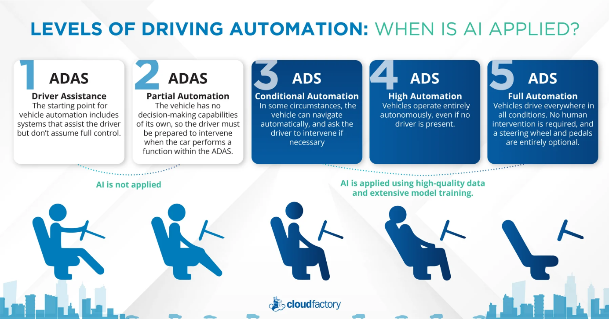
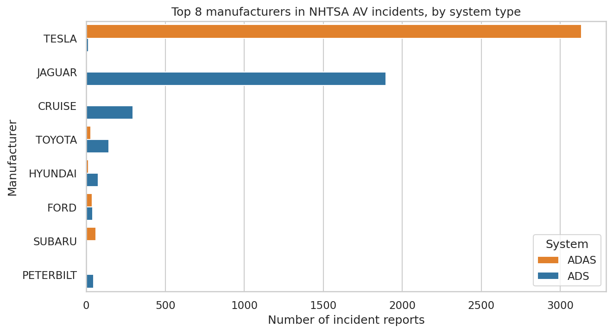
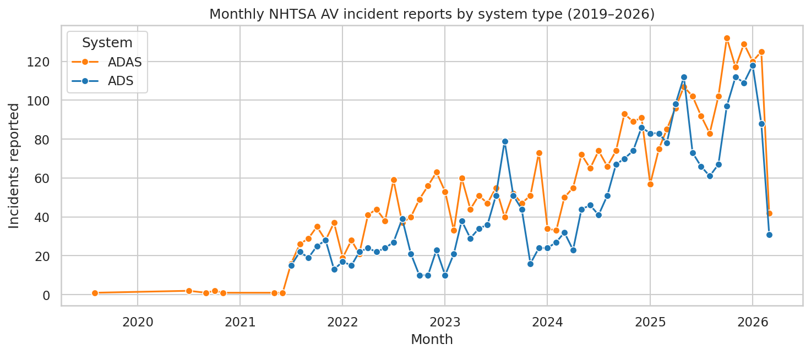
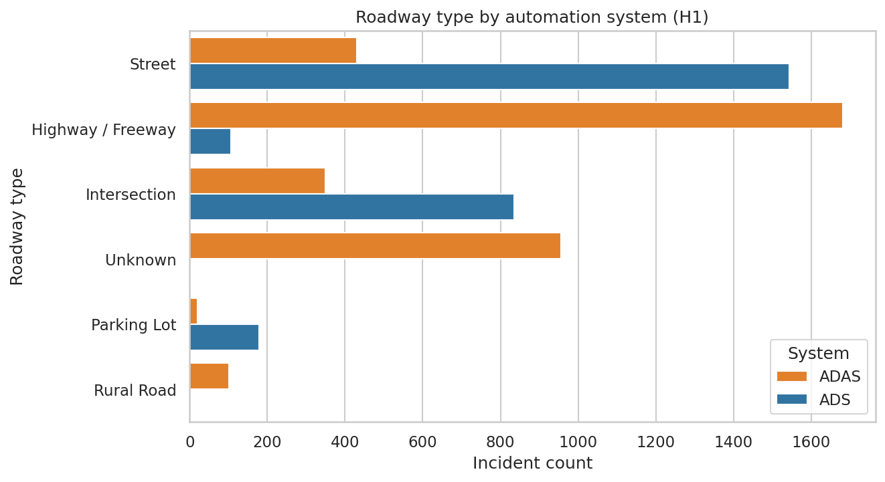
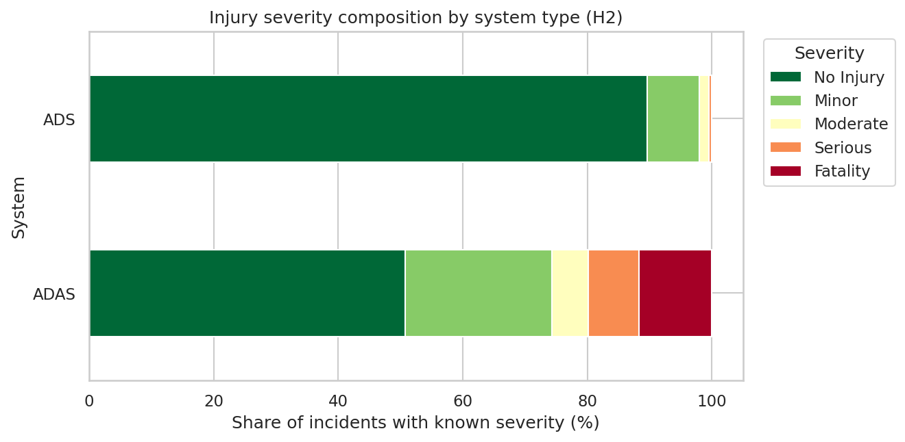
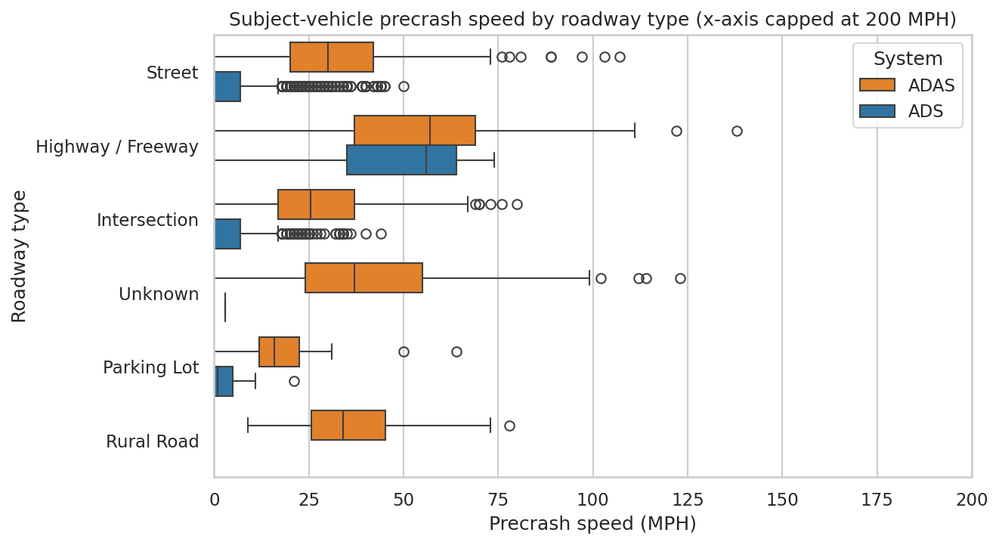
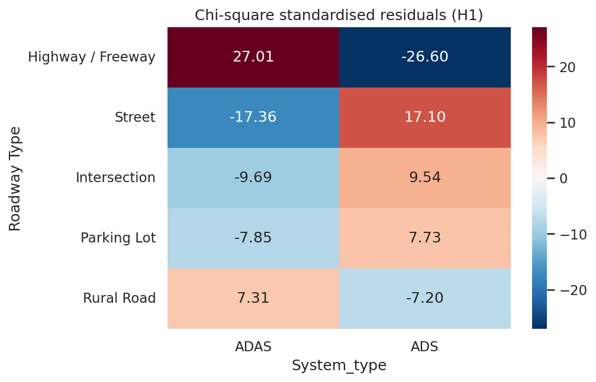
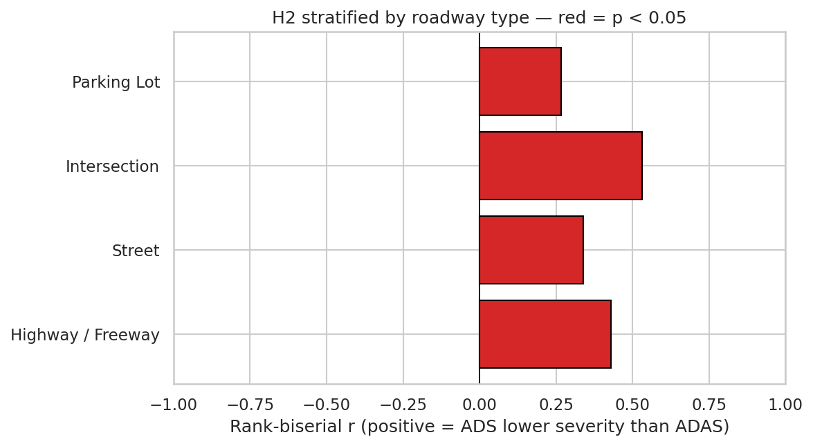

# Assignment 1: Exploratory Data Analysis (EDA) on US National Highway Traffic Safety Administration (NHTSA) Autonomous-Vehicle Incident Reports

**Course:** KQC7016 Data Analytics, Semester 2, 2025/2026
**Theme:** 7. Autonomous Driving
**Group:** Muhammad Amru Bin Mohamad Sharis (S2116804) · Nor Shahadah Fitrah Binti Ramani (25073210)
**Instructor:** Associate Prof. Ir. Dr. Chow Chee Onn
**Submission:** Jupyter notebooks + report 

---

## 1. Introduction

### 1.1 Vehicle Automation: From Driver Assistance to Autonomous Driving

The automotive industry has shifted from fully human-controlled vehicles toward vehicles that delegate part or all of the driving task to automated systems. The Society of Automotive Engineers standard SAE J3016 defines six Levels of Driving Automation: Level 0 (no automation) through Level 5 (full automation in all conditions) (SAE International, 2021). Understanding these levels is essential context before interpreting any Autonomous Vehicle (AV) incident data. The six levels split into two functionally distinct families as shown in Figure 1.1.

*Figure 1.1: Levels of driving automation (CloudFactory, 2022).*

#### 1.1.1 Advanced Driver Assistance Systems (ADAS, Levels 1 and 2)

The human driver retains full responsibility for the dynamic driving task. ADAS features assist with steering (lane-keep assist), speed (adaptive cruise), or both (Level 2 highway lane-centering), but the driver must continuously monitor the road and be ready to intervene. The system cannot relieve the driver of supervisory duty (SAE International, 2021). Tesla Autopilot, Tesla FSD Beta, and GM Super Cruise operate at Level 2.

#### 1.1.2 Automated Driving Systems (ADS, Levels 3 through 5)

The ADS assumes the complete dynamic driving task within a defined Operational Design Domain (ODD). Responsibility for safe operation transfers from human to system during ADS engagement (SAE International, 2021). Commercial Level 4 deployments in the US include Waymo One (Jaguar I-PACE) in Phoenix and San Francisco, and Cruise (Chevrolet Bolt) in San Francisco.

### 1.2 Why the ADAS and ADS Distinction Matters

Despite both being labelled "self-driving" in media coverage, ADAS and ADS differ categorically in who bears the dynamic driving task and therefore who is at fault when something goes wrong. UNECE (2023) flags confusion between the two as a key gap in international regulatory frameworks: with ADAS the driver is responsible and the system is a support tool; with ADS the system is the responsible entity within its ODD and the human becomes a passenger or fallback user. A crash during Tesla Autopilot is a crash where a human failed to supervise an assistance tool; a crash during Waymo operation is one where an automated system failed to complete its assigned task. Sabry et al. (2024) further note that at Level 3 and above, drivers may misunderstand system capabilities and disengage from driving-related activities, creating risks at the human-machine boundary that do not arise in ADAS contexts.

### 1.3 The NHTSA SGO Dataset and Its Relevance

The US National Highway Traffic Safety Administration (NHTSA) Standing General Order 2021-01 (SGO 2021-01) mandates that manufacturers and operators of SAE Level 2 ADAS or Level 3+ ADS vehicles report crashes meeting defined severity thresholds (NHTSA, 2021). Reporting began in June 2021, with a voluntary prior submission covering 2019 onwards. This programme created the largest publicly available real-world record of AV-related crashes. Liu et al. (2024) and Rosique et al. (2023) both note that real-world AV incident datasets of this scale are rare in a research landscape historically dominated by perception benchmarks, making SGO uniquely valuable for empirical safety analysis.

### 1.4 Research Question and Hypotheses

This report uses the NHTSA SGO 2021-01 dataset to answer:

> **"How do incident patterns and injury outcomes differ between vehicles operating with ADS (Level 3+) versus ADAS (Level 1–2) automation in the United States?"**

Two pre-specified hypotheses are tested:

- H1: The distribution of roadway types differs significantly between ADS and ADAS incidents (chi-square test of independence).
- H2: Injury severity differs significantly between ADS and ADAS incidents (Mann-Whitney U test, with stratified sensitivity analysis to address the operational-domain confound).

The full analysis pipeline (data cleaning, EDA, and statistical tests) is implemented in three Jupyter notebooks available at https://github.com/amru231/KQC7016-Data-Analytics under `assignment1/notebooks/` (`01_clean.ipynb`, `02_eda.ipynb`, `03_stats.ipynb`).

---

## 2. Description of the Dataset

### 2.1 Source and Released Files

The dataset is drawn from NHTSA Standing General Order 2021-01: *Incident Reports of Crashes Involving Vehicles Equipped with ADS or Level 2 ADAS* (NHTSA, 2021), publicly available at https://www.nhtsa.gov/laws-regulations/standing-general-order-crash-reporting.

NHTSA releases four CSV files relevant to this study, summarised in Table 2.1.

*Table 2.1: NHTSA SGO 2021-01 incident report files used in this study.*

| File | System class | Period | Rows (raw) | Cols |
|------|--------------|--------|-----------|------|
| `SGO-2021-01_Incident_Reports_ADS.csv` | ADS (Level 3+) | 2025–2026 | 825 | 116 |
| `SGO-2021-01_Incident_Reports_ADS_prior.csv` | ADS (Level 3+) | 2019–early 2025 | 2,295 | 137 |
| `SGO-2021-01_Incident_Reports_ADAS.csv` | ADAS (Level 1–2) | 2025–2026 | 1,145 | 116 |
| `SGO-2021-01_Incident_Reports_ADAS_prior.csv` | ADAS (Level 1–2) | 2019–early 2025 | 4,027 | 137 |

The "current" files use a newer 116-column NHTSA submission template; "prior" files use the legacy 137-column template. Schema differences require reconciliation before the files can be merged.

### 2.2 Dataset Variables and Structure

Each row is a single crash report, and each report is a wide record (116 columns in the current template, 137 in the legacy template) describing one incident involving one subject vehicle (SV). The fields fall into nine thematic groups, summarised in Table 2.2. Most columns are categorical or one-hot binary flags (for example, the eleven `Weather - *` indicators and the contact-area indicators); only a handful are numeric (`SV Precrash Speed (MPH)`, `Posted Speed Limit (MPH)`, `Model Year`, latitude, longitude). This categorical-heavy structure shapes the analysis choices in Sections 3 and 4, where non-parametric and contingency-based tests are preferred over parametric ones.

*Table 2.2: Main variable groups in the NHTSA SGO incident reports.*

| Variable group | Example fields | What it captures |
|----------------|----------------|------------------|
| Report metadata | `Report ID`, `Report Version`, `Reporting Entity`, `Report Type`, `Report Submission Date` | Identifies and version-controls each submission |
| Vehicle identification | `VIN`, `Make`, `Model`, `Model Year`, `Serial Number` | Identifies the subject vehicle |
| Automation system | `Automation System Engaged?`, `Engagement Status`, `Automation Feature Version`, `Driver / Operator Type`, `Operating Entity` | Automation level engaged at the time (ADS / ADAS / Unknown) and who operates the fleet |
| Report source | nine `Source - *` flags (Complaint, Telematics, Law Enforcement, Field Report, Media, etc.) | How NHTSA was notified of the incident |
| Time and location | `Incident Date`, `Incident Time`, `Latitude`, `Longitude`, `City`, `State`, `Zip Code` | When and where the crash occurred |
| Roadway and environment | `Roadway Type`, roadway-condition flags, eleven `Weather - *` flags | Operating environment at the time |
| Crash characteristics | `Crash With`, `SV Pre-Crash Movement`, `CP Pre-Crash Movement`, contact-area flags, `SV Precrash Speed (MPH)`, `Posted Speed Limit (MPH)` | Kinematics of the event |
| Injury and damage | `Highest Injury Severity Alleged`, `Any Air Bags Deployed?`, `Was Any Vehicle Towed?`, `Were All Passengers Belted?`, `Property Damage?` | Outcome and severity |
| Evidence and investigation | `Data Availability - *` flags, `Investigating Agency`, `Within ODD?`, `Narrative` | Supporting evidence and free-text description |

The five columns that carry the analysis are `Automation System Engaged?` (the system-type label), `Roadway Type`, `Highest Injury Severity Alleged`, `Make`, and `SV Precrash Speed (MPH)`. The remaining fields provide context, provenance, and the basis for the missingness handling described in Section 2.5.

### 2.3 Data Cleaning and Preparation

The cleaning pipeline (`01_clean.ipynb`) uses pandas (McKinney, 2010) and performs the following steps:

1. Encoding-tolerant load. One ADAS prior file uses Latin-1 encoding; the loader falls back automatically to avoid decoding failures.
2. Schema reconciliation. Intersect the 116-column and 137-column schemas: 90 columns survive (89 shared NHTSA fields plus a `source_file` provenance tag we inject during load). Five additional analytically valuable prior-only columns are preserved: `Lighting`, `Roadway Surface`, `Posted Speed Limit (MPH)`, `Property Damage?`, `Weather - Fog/Smoke`. Rows from the newer schema carry NaN for these fields, and any analysis using them is scoped to the prior-schema subset.
3. De-duplication. NHTSA reports are versioned: a single incident reappears as new information arrives. We retain the latest `Report Version` per `Report ID`, removing 1,842 superseded versions.
4. Make normalisation. Strip and upper-case the manufacturer field (`Make` → `Make_clean`); merge `JLR` into `JAGUAR` (same Waymo fleet platform).
5. Date parsing. `Incident Date` (MMM-YYYY format) parsed; `Year` and `Month` derived for temporal analysis.
6. Single weather column. Six one-hot weather flags collapsed into a single categorical `Weather_condition`.
7. Ordinal injury encoding. `Highest Injury Severity Alleged` mapped to `Severity_num` ∈ {0 No Injury, 1 Minor, 2 Moderate, 3 Serious, 4 Fatality}; "Unknown" → NaN. NHTSA uses multiple label variants per tier (for example, `Property Damage. No Injured Reported` = 0; `Minor W/ Hospitalization` and `Minor W/O Hospitalization` both = 1); all variants are collapsed to one code so the known-severity subset is not shrunk by label drift.
8. Numeric coercion applied to `SV Precrash Speed (MPH)`, `Posted Speed Limit (MPH)`, and `Model Year`.

### 2.4 Cleaned-Dataset Summary

After cleaning, the working dataset is summarised in Table 2.3.

*Table 2.3: Summary of the cleaned dataset.*

| Property | Value |
|----------|-------|
| Final row count | **6,450** unique incident reports |
| Final column count | 102 (90 intersect + 5 prior-only + 7 derived) |
| Date range | 2019 to 2026 |
| ADS / ADAS / Unknown (system type) | 2,670 / 3,549 / 231 |
| Top manufacturers | Tesla 3,214 (50%) · Jaguar 1,843 (29%) · Cruise 296 · Toyota 181 |
| Rows with known severity | 3,277 (51%) |

### 2.5 Missingness

Table 2.4 reports the columns with the most missing data. Missingness is not random: most of it traces back to the newer submission template and to how severity is reported for ADAS vehicles.

*Table 2.4: Columns with the highest proportion of missing values.*

| Column | % missing |
|--------|-----------|
| `Severity_num` (after encoding "Unknown" as NaN) | 49.2% (driven by ADAS reports, where 86% of ADAS rows list Unknown severity) |
| `Posted Speed Limit (MPH)` | 37.1% |
| `Lighting`, `Roadway Surface`, `Property Damage?` | 29.1% (current-schema rows lack these fields) |
| `Weather_condition` | 21.4% |
| `SV Precrash Speed (MPH)` | 8.3% |
| `State`, `Year` | < 1% |

Every downstream analysis accounts for missingness explicitly: severity tests run on the 3,117-row ADS+ADAS known-severity subset, and lighting and surface visualisations are scoped to the prior-schema subset.

---

## 3. Exploratory Data Analysis

EDA was carried out in `02_eda.ipynb`. All 13 generated figures are available in full resolution at https://github.com/amru231/KQC7016-Data-Analytics under `assignment1/notebooks/plots/`. Key findings are presented below.

### 3.1 Fleet Composition Is Bimodal

Figure 3.1 shows incident report counts by manufacturer. Tesla dominates ADAS reports (Autopilot/FSD Beta on consumer-owned vehicles); Jaguar (Waymo I-PACE) and Cruise dominate ADS reports. This reflects the state of US AV deployment in the reporting window: Tesla's installed fleet dwarfs other ADAS manufacturers, and Waymo and Cruise are the only ADS operators with meaningful commercial mileage during the period (Liu et al., 2024). Because NHTSA mandates reporting from manufacturers rather than owners, report counts partly reflect fleet size, not just crash rate.

*Figure 3.1: Top manufacturers by system type.*

### 3.2 Reporting Volume Has Grown Sharply Since 2022

Figure 3.2 shows monthly incident-report counts. Reports are sparse before mid-2021 (the SGO was issued June 2021) and grow steeply from 2022 onwards, coinciding with Waymo's and Cruise's commercial expansion and Tesla's growing Autopilot fleet (NHTSA, 2021). Pre-2021 entries come from the voluntary prior submission and should be treated cautiously; cross-time comparisons are limited to the post-2021 window.

*Figure 3.2: Monthly incident report counts, 2019–2026.*

### 3.3 ADS and ADAS Operate in Different Driving Domains *(motivates H1)*

The most visually striking pattern in the dataset is the near-complete separation of ADS and ADAS incidents by roadway type, shown in Figure 3.3 and tabulated in Table 3.1.

*Table 3.1: Incident counts by roadway type and system class.*

| Roadway type | ADAS | ADS |
|--------------|------|-----|
| Highway / Freeway | **1,681** | 106 |
| Street | 431 | **1,544** |
| Intersection | 349 | **835** |
| Parking Lot | 20 | **178** |
| Rural Road | 102 | 0 |

ADAS incidents concentrate on highways and freeways, consistent with Autopilot being a highway-cruise feature within its intended ODD. ADS incidents concentrate on streets, intersections, and parking lots, consistent with urban robotaxis geofenced to city centres (UNECE, 2023). Highway crashes at 60+ MPH are mechanically more dangerous than low-speed urban events, so this domain separation matters before any system-type comparison.

*Figure 3.3: Roadway type by system class.*

### 3.4 Severity Distributions Diverge Sharply *(motivates H2)*

Among the 3,117 ADS+ADAS rows with known severity, Figure 3.4 and Table 3.2 show a striking contrast in injury outcomes.

*Table 3.2: Injury severity composition by system type (known-severity subset).*

| Severity | ADS share | ADAS share |
|----------|-----------|------------|
| No Injury | **89.7%** | 50.8% |
| Minor | 8.4% | 23.5% |
| Moderate | 1.5% | 5.8% |
| Serious | 0.4% | 8.2% |
| Fatality | 0.1% | **11.6%** |

The headline contrast (11.6% vs 0.1% fatality share) is striking but must be interpreted carefully. ADAS operates primarily at highway speeds where any crash is mechanically more dangerous. This operational-domain confound is explicitly tested in the stratified analysis of Section 4.2.

*Figure 3.4: Injury severity composition by system type (known-severity subset).*

### 3.5 Weather, Lighting, and Speed Context

#### 3.5.1 Weather

Conditions at the time of the incident are overwhelmingly clear (~72%) or cloudy (~24%); rain, snow, and fog combined account for less than 4%. Adverse-weather slices are too sparse for meaningful statistical testing.

#### 3.5.2 Lighting

In the prior-schema subset, lighting is predominantly daylight, with dark-lighted and dark-not-lighted making up the bulk of the remainder. ADS and ADAS proportions are broadly similar, confirming lighting does not drive the system-type differences observed.

#### 3.5.3 Pre-Crash Speed

Pre-crash speed (Figure 3.5) is cleanly stratified by roadway type: highway median 50–60 MPH versus street/intersection median below 20 MPH. This quantitatively confirms the operational-domain difference and explains why highway-dominant ADAS incidents carry higher injury rates.

*Figure 3.5: Pre-crash speed (MPH) by roadway type.*

#### 3.5.4 Correlation Matrix

The only meaningful Pearson correlation is `SV Precrash Speed` ↔ `Posted Speed Limit` (~0.6, expected); all other numeric pairs are weak.

---

## 4. Statistical Analysis

All tests are implemented in `03_stats.ipynb` (see https://github.com/amru231/KQC7016-Data-Analytics). Statistical tests use `scipy.stats` and `statsmodels`.

### 4.1 H1: Roadway Type Is Associated with System Type (Chi-Square)

#### 4.1.1 Test Rationale

The test examines the association between two categorical variables (roadway type × system class) on a large sample, using Pearson's chi-square test of independence, with Cramér's V for a scale-independent effect size.

#### 4.1.2 Contingency Table

Table 4.1 gives the contingency table over the five main roadway categories (`Unknown` excluded).

*Table 4.1: Contingency table of roadway type by system class.*

| Roadway type | ADAS | ADS | Row total |
|--------------|------|-----|-----------|
| Highway / Freeway | 1,681 | 106 | 1,787 |
| Street | 431 | 1,544 | 1,975 |
| Intersection | 349 | 835 | 1,184 |
| Parking Lot | 20 | 178 | 198 |
| Rural Road | 102 | 0 | 102 |
| **Column total** | **2,583** | **2,663** | **5,246** |

#### 4.1.3 Assumption Check

All expected cell counts under H₀ are ≥ 50.2, so the chi-square minimum expected frequency assumption is satisfied with margin.

#### 4.1.4 Result and Decision

The test result is reported in Table 4.2.

*Table 4.2: Chi-square test of independence result (H1).*

| Statistic | Value |
|-----------|-------|
| χ² | 2,442.29 |
| df | 4 |
| p-value | < 0.001 |
| N | 5,246 |
| Cramér's V (effect size) | **0.682, large** (Cohen's convention) |

Decision: reject H₀ at α = 0.001.

Figure 4.1 shows standardised Pearson residuals identifying which cells drive the rejection: ADAS is over-represented on highways/freeways (residual = +27.01) and rural roads (+7.31); ADS is over-represented on streets (+17.10), intersections (+9.54), and parking lots (+7.73). The two system families occupy near-non-overlapping road environments. This is the strongest statistical pattern in the dataset, reflecting their different ODDs (SAE International, 2021; UNECE, 2023).

*Figure 4.1: Standardised Pearson residuals from the H1 chi-square test.*

### 4.2 H2: Injury Severity Differs by System Type (Mann-Whitney U)

#### 4.2.1 Test Rationale

`Severity_num` is ordinal (0–4), strongly right-skewed, with many ties at zero, so a parametric t-test or ANOVA is inappropriate. Mann-Whitney U compares rank sums between two independent groups and tests for stochastic dominance on ordinal data without normality assumptions.

#### 4.2.2 Group Sizes

The two groups (ADS+ADAS rows with known severity) are summarised in Table 4.3.

*Table 4.3: Severity group sizes by system type (known-severity subset).*

| System | N | Median | Mean |
|--------|---|--------|------|
| ADS | 2,619 | 0.0 | 0.13 |
| ADAS | 498 | 0.0 | 1.06 |

#### 4.2.3 Result and Decision

The test result is reported in Table 4.4.

*Table 4.4: Mann-Whitney U test result (H2, pooled).*

| Statistic | Value |
|-----------|-------|
| Mann-Whitney U | 385,754 |
| p-value (two-sided) | 4.97 × 10⁻¹¹¹ |
| Rank-biserial r (effect size) | **+0.408, medium** |
| Direction | ADS incidents have lower ordinal severity than ADAS |

Decision: reject H₀ at α = 0.001.

#### 4.2.4 Stratified Sensitivity Analysis

The pooled result conflates the system-type effect with the operational-domain confound identified in H1 (ADAS on highways, ADS on streets). To isolate the system-type effect, Mann-Whitney U is re-run within each main roadway category (Figure 4.2); the per-stratum results are reported in Table 4.5.

*Table 4.5: Stratified Mann-Whitney U results by roadway type.*

| Roadway | N ADS | N ADAS | p-value | rank-biserial r |
|---------|-------|--------|---------|-----------------|
| Highway / Freeway | 102 | 291 | 2.18 × 10⁻¹³ | **0.430** |
| Street | 1,522 | 75 | 1.56 × 10⁻¹⁹ | **0.340** |
| Intersection | 811 | 33 | 5.23 × 10⁻¹⁷ | **0.532** |
| Parking Lot | 177 | 7 | 3.43 × 10⁻⁴ | **0.266** |
| Rural Road | 0 | 14 | n/a | insufficient N |

The severity gap persists with p < 0.001 in every stratum with usable data, and the effect size remains small-to-large (r = 0.266–0.532). The H2 result is **not** purely an artefact of the operational-domain difference.

*Figure 4.2: Stratified Mann-Whitney U effect sizes (rank-biserial r) by roadway type.*

---

## 5. Discussion

### 5.1 Operational Domain Is the Primary Structural Distinction

Operational domain is the primary structural distinction between ADS and ADAS in real-world deployment. The H1 chi-square effect (Cramér's V = 0.682) is among the largest effect sizes typically seen for a contingency analysis on administrative data, and it survives every robustness check applied. ADAS features are designed for sustained high-speed highway cruising within their ODD, while Level 4 ADS robotaxis are geofenced to urban areas that define their ODD (SAE International, 2021). UNECE (2023) notes that this operational-scope difference is precisely why ADAS and ADS require different regulatory treatment. Any safety comparison that does not condition on roadway type conflates two fundamentally different operational contexts.

### 5.2 Within-Stratum Severity Differences Persist

Within each stratum, ADS incidents still have lower ordinal injury severity than ADAS incidents. The stratified Mann-Whitney analysis (Section 4.2) rules out a pure "highway physics" explanation. Even on streets, intersections, and parking lots (where ADS robotaxis operate at low speed), ADAS incidents show higher severity. Three explanations remain plausible: (a) collision physics differences between rare high-energy ADAS urban events and typical low-speed ADS urban events in the same bin; (b) systematic differences in collision partners (ADS encounters predominantly passenger cars at low urban speeds, whereas ADAS street events may involve more diverse partners); or (c) reporting bias, given that 86% of ADAS reports list "Unknown" severity, so the known-severity ADAS subset likely over-represents injurious events. The dataset cannot separate these. Sabry et al. (2024) note that the human-machine boundary differs across automation levels, affecting both what crashes occur and how they are recorded.

### 5.3 Limitations

Several limitations qualify these findings. The most consequential is that severity reporting is highly asymmetric: 86% of ADAS reports list "Unknown" severity versus less than 2% of ADS reports, so the Mann-Whitney comparison rests on a biased ADAS subset that likely over-represents injurious events. A second limitation is that vehicle exposure (miles driven) is absent from the dataset, which means incident counts cannot be converted to per-mile rates, the most important denominator for any per-system safety claim. A third concerns schema coverage, because the "current" NHTSA template (mid-2025 onwards) drops `Lighting`, `Roadway Surface`, and `Property Damage?`, and analyses using these fields are therefore scoped to prior-schema rows only. Finally, the dataset is US-only, so the findings do not transfer directly to Malaysian or other non-US AV deployments operating under different regulatory regimes (UNECE, 2023).

---

## 6. Conclusion

This study examined how real-world incident patterns and injury outcomes differ between vehicles operating with ADS (Level 3+) and ADAS (Level 1–2) automation, using NHTSA Standing General Order crash reports from 2019 to 2026. The exploratory analysis and hypothesis tests converge on a consistent picture: ADS and ADAS occupy fundamentally different operational worlds. ADAS-equipped vehicles generate crashes overwhelmingly on highways and freeways at high speed, while ADS-equipped robotaxis generate crashes in urban streets, intersections, and parking lots at low speed. Injury severity is consistently lower for ADS incidents than for ADAS incidents, and this gap persists even after controlling for roadway type, suggesting the difference is not purely a product of highway-speed physics but also reflects differences in collision contexts, fleet behaviour, and severity-reporting completeness.

The practical takeaway is that ADAS and ADS should not be evaluated as if they sampled the same risk environment, because they serve different use cases, deploy within different ODDs, and assign driving responsibility differently between human and machine (SAE International, 2021; UNECE, 2023). Future safety policy and research should make this distinction explicit. The findings are descriptive associations, not causal claims: exposure (miles driven) and complete severity reporting are prerequisites for any per-mile safety conclusion. Even so, the dataset offers one of the clearest empirical pictures available of how AV safety patterns vary across automation paradigms in real-world US deployment.

---

## 7. References

CloudFactory. (2022, January 27). *Understanding the levels of autonomous vehicles & the role of ADS in cars*. https://www.cloudfactory.com/blog/where-do-ads-and-adas-fall-into-levels-of-driving-automation

Liu, M., Yurtsever, E., Fossaert, J., Zhou, X., Zimmer, W., Cui, Y., Zagar, B. L., & Knoll, A. C. (2024). A survey on autonomous driving datasets: Statistics, annotation quality, and a future outlook. *IEEE Transactions on Intelligent Vehicles*, *9*(11), 7138–7158. https://doi.org/10.1109/TIV.2024.3394735

McKinney, W. (2010). Data structures for statistical computing in Python. In S. van der Walt & J. Millman (Eds.), *Proceedings of the 9th Python in Science Conference* (pp. 56–61). SciPy.

National Highway Traffic Safety Administration. (2021). *Standing General Order 2021-01: Incident reports of crashes involving vehicles equipped with ADS or Level 2 ADAS* [Dataset]. U.S. Department of Transportation. https://www.nhtsa.gov/laws-regulations/standing-general-order-crash-reporting

Rosique, F., Navarro, P. J., Miller, L., & Salas, E. (2023). Autonomous vehicle dataset with real multi-driver scenes and biometric data. *Sensors*, *23*, 2009. https://doi.org/10.3390/s23042009

SAE International. (2021). *Taxonomy and definitions for terms related to driving automation systems for on-road motor vehicles* (Standard No. J3016_202104). SAE International. https://www.sae.org/standards/content/j3016_202104/

Sabry, M., Morales-Alvarez, W., & Olaverri-Monreal, C. (2024). Automated vehicle driver monitoring dataset from real-world scenarios. *2024 IEEE Intelligent Transportation Systems Conference (ITSC)*. https://doi.org/10.1109/ITSC58415.2024.10920048

Shi, X., Tseng, N.-H., & Weymann, J. (2021). *The principles of operation framework: A comprehensive classification concept for automated driving functions*. SAE Technical Paper.

United Nations Economic Commission for Europe (UNECE). (2023). *Industry view on gaps that need addressing and approach towards bridging these gaps to progress GE3 work programme* (Informal Document No. 7, GE.3-07-09). UNECE Global Forum for Road Traffic Safety, Group of Experts on drafting a new legal instrument on the use of automated vehicles in traffic (GE.3).

---

*Source code: Three Jupyter notebooks (`01_clean.ipynb`, `02_eda.ipynb`, `03_stats.ipynb`) are available at https://github.com/amru231/KQC7016-Data-Analytics under `assignment1/notebooks/`. All 13 generated figures are under `assignment1/notebooks/plots/`.*
