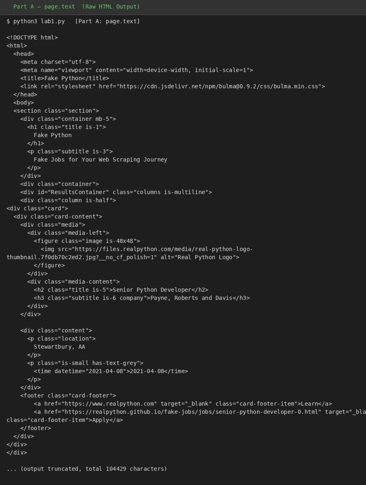
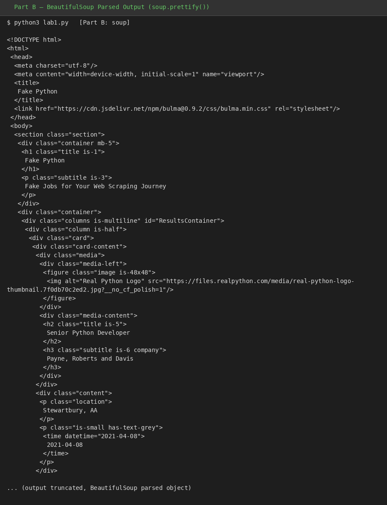
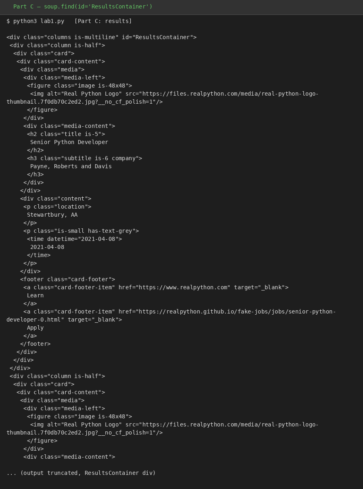
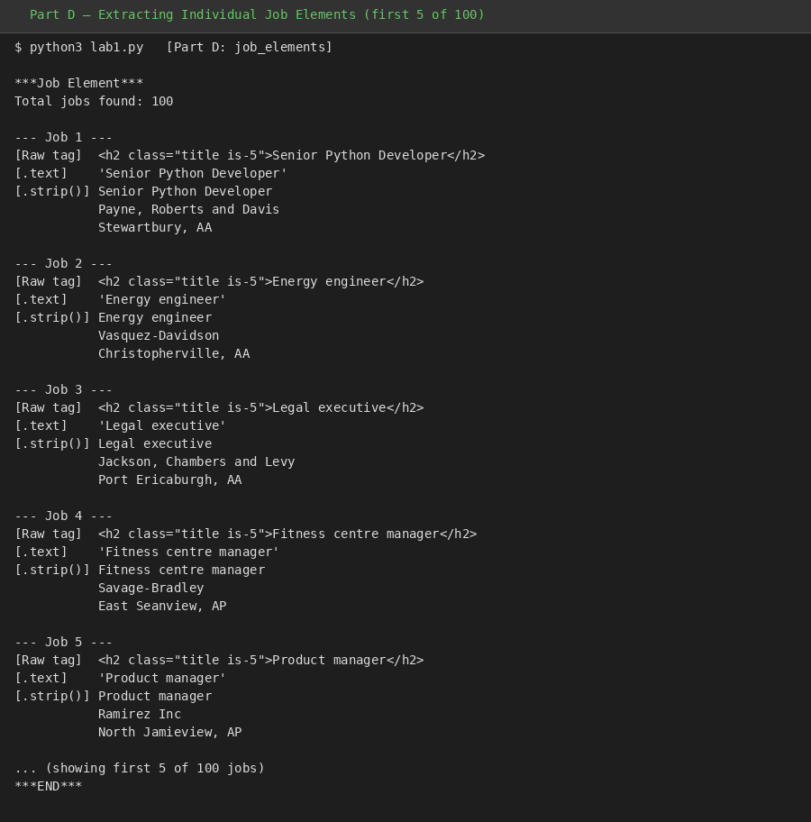
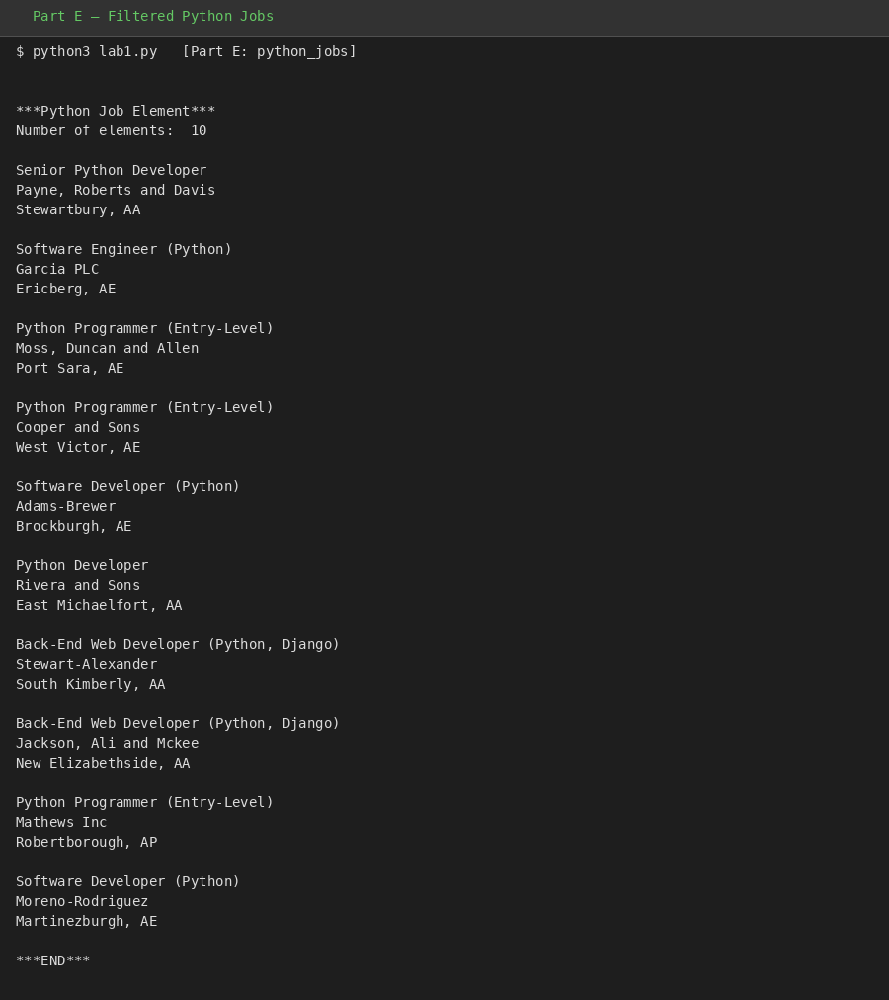

# Lab 1 Report: Web Scraping

**Course:** KQC7016 Data Analytics
**Lab:** Lab 1 - Web Scraping (5%)

---

## Chapter 1: Introduction

Web scraping is an automated method of extracting large amounts of data from websites. It works by sending HTTP requests to a target URL, receiving the HTML response, and then parsing that HTML to extract specific data of interest. The extracted unstructured data is then stored in a structured form for further analysis.

Web scraping is widely used in data analytics for gathering datasets from online sources such as job portals, e-commerce sites, news websites, and social media platforms. Python is one of the most popular languages for web scraping due to its rich ecosystem of libraries.

### Objectives

1. Study and understand the provided web scraping code (`lab1.py`) that scrapes job listings from a fake jobs website.
2. Run and examine the output of each part of the code to understand the scraping process step by step.
3. Modify the code to perform web scraping on a different website (`lab1_modified.py`), demonstrating the transferability of web scraping techniques.
4. Document the methodology, observations, and findings in this report.

---

## Chapter 2: Methodology

### 2.1 Tools and Libraries

The following Python libraries were used:

- **Requests**: Used to send HTTP requests to the target URL and retrieve the HTML content of the web page.
- **BeautifulSoup (bs4)**: Used to parse the HTML content and navigate the document tree to find and extract specific elements.

### 2.2 Part 1 - Original Code (`lab1.py`)

The original code (`lab1.py`) scrapes job listings from `https://realpython.github.io/fake-jobs/`, a static website designed for practising web scraping. The code is structured in progressive parts, each building on the previous one:

**Part A - Fetching Raw HTML (`page.text`)**
```python
URL = "https://realpython.github.io/fake-jobs/"
page = requests.get(URL)
print(page.text)
```
This sends an HTTP GET request to the URL and prints the raw HTML response. The output is the complete HTML source code of the page (104,429 characters), including all tags, attributes, and content in its unprocessed form.

**Part B - Parsing with BeautifulSoup (`soup`)**
```python
soup = BeautifulSoup(page.content, "html.parser")
print(soup)
```
The raw HTML content is parsed by BeautifulSoup into a navigable tree structure. While the output appears similar to the raw HTML, the content is now a BeautifulSoup object that can be searched, filtered, and navigated programmatically. The `prettify()` method formats the output with proper indentation for readability.

**Part C - Finding the Results Container (`results`)**
```python
results = soup.find(id="ResultsContainer")
print(results.prettify())
```
This narrows the scope by finding only the `<div>` element with `id="ResultsContainer"`, which contains all the job listing cards. This is a key step in web scraping — identifying the container that holds the data of interest, rather than processing the entire page.

**Part D - Extracting Individual Job Elements**
```python
job_elements = results.find_all("div", class_="card-content")
for job_element in job_elements:
    title_element = job_element.find("h2", class_="title")
    company_element = job_element.find("h3", class_="company")
    location_element = job_element.find("p", class_="location")
```
This iterates through all 100 job cards and extracts three fields from each: job title (`<h2>`), company name (`<h3>`), and location (`<p>`). The code demonstrates three levels of accessing text:
- Raw element (includes HTML tags): `<h2 class="title is-5">Senior Python Developer</h2>`
- `.text` (includes whitespace): `\n        Stewartbury, AA\n      `
- `.text.strip()` (clean text): `Stewartbury, AA`

**Part E - Filtering Python-Specific Jobs**
```python
python_jobs = results.find_all("h2", string=lambda text: "python" in text.lower())
python_job_elements = [h2_element.parent.parent.parent for h2_element in python_jobs]
```
This uses a lambda function to filter only job listings that contain "python" (case-insensitive) in the title. It then navigates up the DOM tree using `.parent` three times to get the full card element for each matching job. This demonstrates targeted data extraction — filtering a large dataset down to relevant results.

### 2.3 Part 2 - Modified Code (`lab1_modified.py`)

The modified code scrapes quotes from `https://quotes.toscrape.com/`, a website designed for scraping practice. The approach follows the same methodology but targets a different data structure:

```python
URL = "https://quotes.toscrape.com/"
page = requests.get(URL)
soup = BeautifulSoup(page.content, "html.parser")
quotes = soup.find_all("div", class_="quote")
for quote in quotes:
    text_element = quote.find("span", class_="text")
    author_element = quote.find("small", class_="author")
```

The key differences from the original code:
- Targets `<div class="quote">` elements instead of `<div class="card-content">`
- Extracts quote text (`<span class="text">`) and author name (`<small class="author">`)
- Uses a simpler structure without the need for parent traversal

---

## Chapter 3: Observations and Results

### 3.1 Part A - Raw HTML Output

Running `page.text` returned the complete HTML source code of the Fake Python jobs page, totalling 104,429 characters. The raw output includes all HTML tags, CSS class names, and the actual content mixed together, making it difficult to read or extract useful data directly.



### 3.2 Part B - BeautifulSoup Parsed Output

After parsing with BeautifulSoup, the output was formatted with proper indentation using `prettify()`. While visually similar to the raw HTML, the data is now stored as a navigable object, allowing programmatic access to any element by tag name, class, or ID.



### 3.3 Part C - Results Container

Using `soup.find(id="ResultsContainer")` successfully isolated the main content area containing all job listings, filtering out the page header, stylesheets, and other irrelevant HTML elements.



### 3.4 Part D - Extracted Job Listings

A total of **100 job listings** were extracted from the page. Each listing contains:
- **Job Title** (e.g., "Senior Python Developer")
- **Company Name** (e.g., "Payne, Roberts and Davis")
- **Location** (e.g., "Stewartbury, AA")

The output also demonstrated the importance of `.text.strip()` over `.text` — the location field in particular contained significant leading/trailing whitespace when accessed with `.text` alone.



Sample output (first 5 jobs):

| # | Job Title | Company | Location |
|---|-----------|---------|----------|
| 1 | Senior Python Developer | Payne, Roberts and Davis | Stewartbury, AA |
| 2 | Energy engineer | Vasquez-Davidson | Christopherville, AA |
| 3 | Legal executive | Jackson, Chambers and Levy | Port Ericaburgh, AA |
| 4 | Fitness centre manager | Savage-Bradley | East Seanview, AP |
| 5 | Product manager | Ramirez Inc | North Jamieview, AP |

### 3.5 Part E - Filtered Python Jobs

The filtering operation found **10 out of 100** jobs containing "python" in the title:



| # | Job Title | Company | Location |
|---|-----------|---------|----------|
| 1 | Senior Python Developer | Payne, Roberts and Davis | Stewartbury, AA |
| 2 | Software Engineer (Python) | Garcia PLC | Ericberg, AE |
| 3 | Python Programmer (Entry-Level) | Moss, Duncan and Allen | Port Sara, AE |
| 4 | Python Programmer (Entry-Level) | Cooper and Sons | West Victor, AE |
| 5 | Software Developer (Python) | Adams-Brewer | Brockburgh, AE |
| 6 | Python Developer | Rivera and Sons | East Michaelfort, AA |
| 7 | Back-End Web Developer (Python, Django) | Stewart-Alexander | South Kimberly, AA |
| 8 | Back-End Web Developer (Python, Django) | Jackson, Ali and Mckee | New Elizabethside, AA |
| 9 | Python Programmer (Entry-Level) | Mathews Inc | Robertborough, AP |
| 10 | Software Developer (Python) | Moreno-Rodriguez | Martinezburgh, AE |

### 3.6 Modified Code - Quotes Output

The modified code successfully scraped **10 quotes** from `quotes.toscrape.com`:

| # | Quote (excerpt) | Author |
|---|-----------------|--------|
| 1 | "The world as we have created it is a process of our thinking..." | Albert Einstein |
| 2 | "It is our choices, Harry, that show what we truly are..." | J.K. Rowling |
| 3 | "There are only two ways to live your life..." | Albert Einstein |
| 4 | "The person, be it gentleman or lady..." | Jane Austen |
| 5 | "Imperfection is beauty, madness is genius..." | Marilyn Monroe |
| 6 | "Try not to become a man of success..." | Albert Einstein |
| 7 | "It is better to be hated for what you are..." | Andre Gide |
| 8 | "I have not failed. I've just found 10,000 ways..." | Thomas A. Edison |
| 9 | "A woman is like a tea bag..." | Eleanor Roosevelt |
| 10 | "A day without sunshine is like, you know, night." | Steve Martin |

---

## Chapter 4: Discussion

### 4.1 Web Scraping Process

The lab demonstrated a systematic approach to web scraping that follows a clear pipeline: **request** the page, **parse** the HTML, **locate** the container, **extract** individual elements, and optionally **filter** results. Each step progressively narrows down the data from a full HTML page (100,000+ characters) to clean, structured information.

### 4.2 Importance of HTML Structure Understanding

Both the original and modified code required inspecting the target website's HTML structure to identify the correct tags and class names. For the jobs site, the key identifiers were `id="ResultsContainer"`, `class="card-content"`, and specific `h2`, `h3`, `p` tags. For the quotes site, the structure differed — `class="quote"` containers with `span` and `small` tags. This highlights that web scraping code must be tailored to each website's specific HTML structure.

### 4.3 Text Extraction Methods

The lab clearly demonstrated the difference between three text access methods:
- **Raw element**: Returns the full HTML tag with attributes — useful for debugging but not for data storage.
- **`.text`**: Extracts the text content but retains whitespace and formatting characters.
- **`.text.strip()`**: Produces clean text suitable for data storage and analysis.

This is an important consideration when building data pipelines, as unstripped text can cause issues in downstream processing.

### 4.4 Data Filtering with Lambda Functions

The use of `string=lambda text: "python" in text.lower()` demonstrated how BeautifulSoup supports functional filtering. This approach is flexible and can be adapted for various search criteria. The parent traversal (`h2_element.parent.parent.parent`) shows how to navigate the DOM tree to retrieve full records from a matched sub-element.

### 4.5 Ethical Considerations

Web scraping should always be performed ethically. Before scraping a website, one should check the site's `robots.txt` file (by appending `/robots.txt` to the URL) to verify whether scraping is permitted. Both websites used in this lab are specifically designed for scraping practice, so there are no ethical concerns.

### 4.6 Transferability of Techniques

The modified code demonstrated that the core web scraping methodology is transferable across different websites. The same libraries (Requests + BeautifulSoup) and the same general approach (fetch, parse, find, extract) were applied to a completely different website with a different HTML structure. The main adaptation required was identifying the correct HTML tags and class names for the new target site.

---

## Chapter 5: Conclusion

This lab successfully demonstrated the fundamentals of web scraping using Python. Through the study and execution of `lab1.py`, we gained an understanding of each step in the web scraping pipeline — from sending HTTP requests and parsing HTML content, to locating specific containers, extracting data fields, and filtering results based on criteria.

The original code extracted 100 job listings from a fake jobs website and filtered them down to 10 Python-related positions. The modified code (`lab1_modified.py`) applied the same techniques to scrape 10 quotes with their authors from a different website, demonstrating the adaptability of web scraping methods.

Key takeaways from this lab include:
1. Web scraping follows a structured pipeline of request, parse, locate, extract, and filter.
2. Understanding the target website's HTML structure is essential for writing effective scraping code.
3. BeautifulSoup provides powerful methods for navigating and searching HTML documents.
4. The `.text.strip()` method is crucial for obtaining clean, usable text from HTML elements.
5. Ethical considerations such as checking `robots.txt` should always be observed before scraping.

---

**GitHub Link:** [KQC7016-Data-Analytics](https://github.com/amru231/KQC7016-Data-Analytics)
