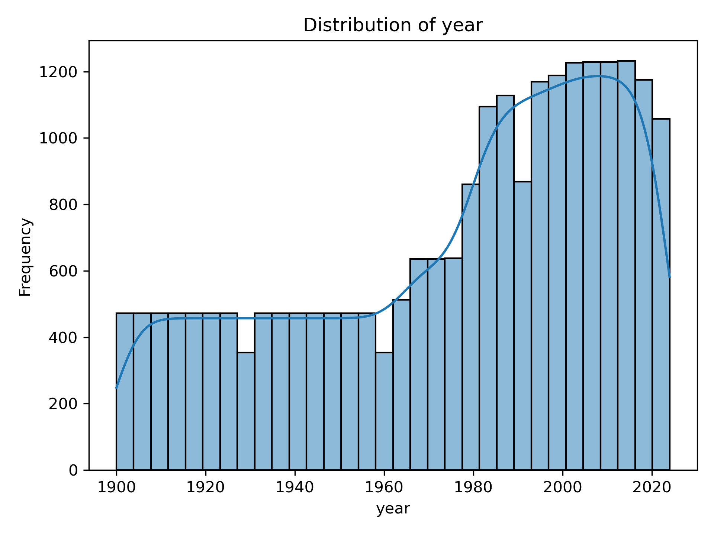
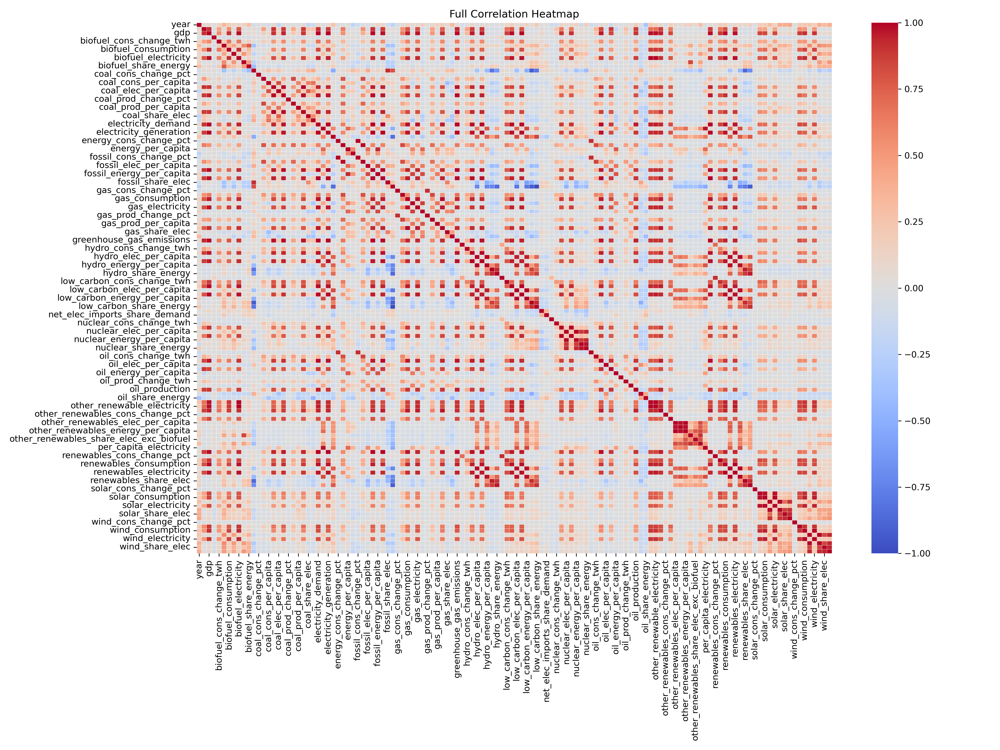
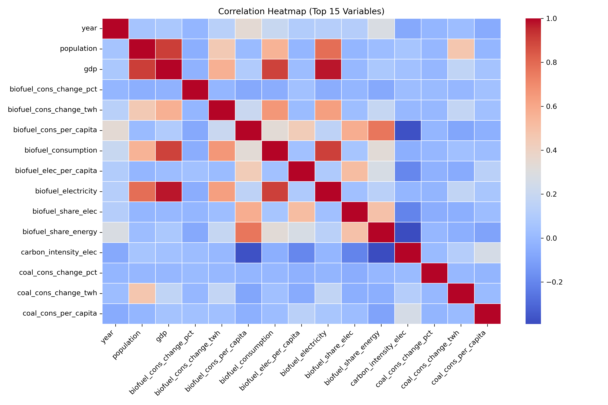

# Lab 2 Report: EDA

**Course:** KQC7016 Data Analytics
**Lab:** Lab 2 - EDA (5%)

---

## Chapter 1: Introduction

Exploratory Data Analysis or known as EDA 

Exploratory Data Analysis (EDA) is an essential step in data analytics that involves summarizing and visualizing datasets to understand their structure, patterns, and relationships. It helps identify key characteristics of the data before applying advanced analytical techniques. In other word, EDA helps in uncovering patterns, spotting anomalies, testing hypotheses, and checking assumptions.

In this lab, EDA is performed on the World Energy dataset, which contains various indicators related to global energy production, consumption, and related factors. The dataset includes multiple numerical variables representing different aspects of energy usage across time and regions.

The purpose of this analysis is to gain a better understanding of the dataset by examining its statistical properties and visualizing relationships between variables. This process can enhance support further analysis and decision-making.

### Objectives

The objectives of this lab are:
1. To study and understand the World Energy dataset (WorldEnergy.csv), including its structure, variables, and key characteristics.
2. To develop a Python program (Lab2.py) and implement it in GitHub to perform Exploratory Data Analysis (EDA) on the dataset.
3. To generate meaningful visualisations, such as histograms and correlation heatmaps, in order to explore patterns, distributions, and relationships among variables.
4. To analyze and interpret the results obtained from the EDA process.
5. To identify and explain the type of data analytics project and the category of data analytics that can be applied to this dataset.

## Chapter 2: Methodology

The methodology of this lab consists of several steps to perform Exploratory Data Analysis (EDA) on the World Energy dataset using Python including ata collection, data cleaning, exploratory data analysis (EDA), modelling, and evaluation.

### 2.1 Data Collection

The dataset used in this lab2 is the World Energy dataset (WorldEnergy.csv), which contains various numerical variables related to global energy production, consumption, and other energy-related indicators.

### 2.2 Data Cleaning

Before performing analysis, basic data inspection was carried out to ensure data quality. The dataset was examined using functions such as info() and describe() to identify data types, missing values, and inconsistencies.

No major data cleaning operations were required, as the dataset was found to be largely complete and suitable for analysis. Numerical variables were selected for further processing, while non-numerical variables were excluded from correlation analysis.

### 2.3 Exploratory Data Analysis (EDA)

Exploratory Data Analysis was conducted to understand the structure and characteristics of the dataset. The following steps were performed:
- Data preview using head() to observe sample records
- Statistical summary using describe() to understand central tendency and dispersion
- Visualization of data distribution using histograms
- Analysis of relationships between variables using correlation heatmaps

Two types of heatmaps were generated:
- A full correlation heatmap to provide an overall view of relationships
- A simplified heatmap using selected variables to improve readability

### 2.4 Modelling

In this lab,descriptive analysis through visualization techniques were developed. The correlation heatmap serves as a simple analytical model to represent relationships between variables quantitatively.

This step lays the foundation for potential future modelling, such as regression or clustering, by identifying important variables and relationships.

### 2.5 Evaluation

The results of the analysis were evaluated based on the clarity and usefulness of the visualisations. The histogram effectively shows the distribution of selected variables, while the heatmaps highlight correlations between variables.

### Chapter 3: Data Observations and Result

The results obtained from the exploratory data analysis provide several insights into the structure and relationships within the World Energy dataset.

### 3.1 Data Overview

The dataset contains a large number of variables, indicating a complex structure with multiple energy-related indicators. Most variables are numerical, making the dataset suitable for statistical analysis.

### 3.2 Histogram Analysis

The histogram shows that the data is not evenly distributed across time. There are fewer records in earlier years, while the number of observations increases significantly from around the 1970s onwards. This suggests that the dataset is more focused on recent years.

### 3.3 Full Heatmap Analysis

The full heatmap provides an overall view of relationships between all variables. However, due to the large number of variables, the visualisation appears dense and difficult to interpret in detail.

### 3.4 Heatmap Analysis - Top 15 Version

Heatmap analysis with top 15 were generated. From this, we can observed that:
- Some variables exhibit strong positive correlations, suggesting that they increase together
- Other variables show weak or near-zero correlations, indicating little or no linear relationship
- A few negative correlations may be present, indicating inverse relationships

### 3.5 Overall Findings

Overall, the analysis shows that the dataset contains a mixture of strongly related and independent variables. The use of visualisation techniques helps identify patterns, relationships, and potential areas for further analysis.

These findings demonstrate the effectiveness of exploratory data analysis in understanding complex datasets and preparing them for more advanced analytical methods.

### Chapter 4: Discussion & Type of Data Analytics 

The exploratory analysis shows that the World Energy dataset is quite large and complex, with many variables that are related in different ways. Using visualisations such as histograms and heatmaps makes it much easier to understand these relationships compared to looking at raw data alone.

The histogram shows that the dataset is not evenly distributed over time, with more data available in recent years. This likely reflects improvements in data collection and reporting over time.

The full heatmap provides a general overview of relationships but is difficult to interpret due to its complexity. In contrast, the simplified heatmap makes it easier to identify key relationships between variables.

In comparison, the heatmap with the top 15 variables is much clearer and easier to understand. From this graph, some relationships stand out more clearly. For example, population and GDP appear to have a strong positive relationship, meaning they tend to increase together. Similarly, variables related to biofuel consumption and electricity also show strong positive correlations, indicating that these factors are closely linked.

There are also some variables that show weak or almost no relationship, which means they do not strongly influence each other. A few negative relationships can also be seen, although they are less obvious compared to the positive ones.

Overall, the analysis shows that while large datasets can be complex, appropriate visualisation techniques can help reveal useful patterns and improve understanding.

### 4.1 Type of Data Analytics Involved

There are several types of data analytics that can be applied to a dataset, including univariate, bivariate, and multivariate analysis.

Univariate analysis focuses on a single variable. In this lab, it is demonstrated using the histogram, which shows the distribution of a numerical variable.

Bivariate analysis examines the relationship between two variables. This can be observed through correlation values in the heatmap.

Multivariate analysis involves multiple variables at the same time. The heatmaps generated in this lab show relationships among many variables simultaneously.

Exploratory Data Analysis (EDA) is used to detect patterns and relationships through visualisation. Patterns may appear as trends over time, correlations between variables, or groupings of related variables.

In addition, descriptive statistics such as mean, median, and standard deviation are used to summarise the dataset.

Overall, this lab primarily demonstrates descriptive data analytics, as it focuses on summarising and visualising the dataset to understand its key characteristics.

### Chapter 5: Conclusion

In this lab, exploratory data analysis was carried out on the World Energy dataset using Python. The use of simple visualisation techniques helped organise and present the data in a more understandable way.

Key Takeaways:

1. The World Energy dataset contains many variables, and most of them are numerical. Understanding the structure of the dataset is important before starting any analysis.
2. Writing the Python program (lab2.py) helped in learning how to perform EDA using tools like pandas, as well as managing the project using GitHub.
3. Visualisations such as histograms and heatmaps are very useful in understanding the data. The histogram shows how the data is distributed, while the heatmaps show relationships between variables.
4. Interpreting the graphs helps to gain better insights. 
5. This lab mainly uses descriptive data analytics, as it focuses on understanding and summarising the dataset. However, the dataset can also be used for more advanced analysis in the future.

---

**GitHub Link:** [KQC7016-Data-Analytics](https://github.com/amru231/KQC7016-Data-Analytics)

