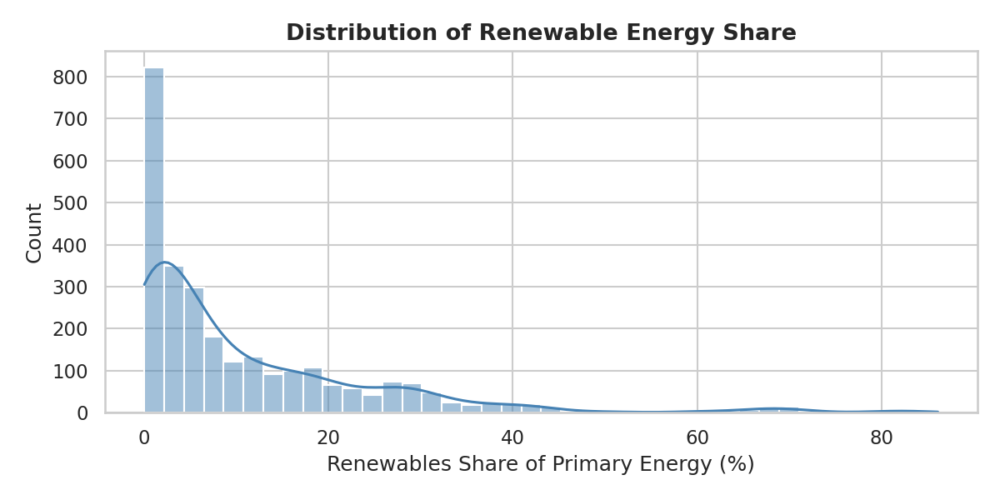
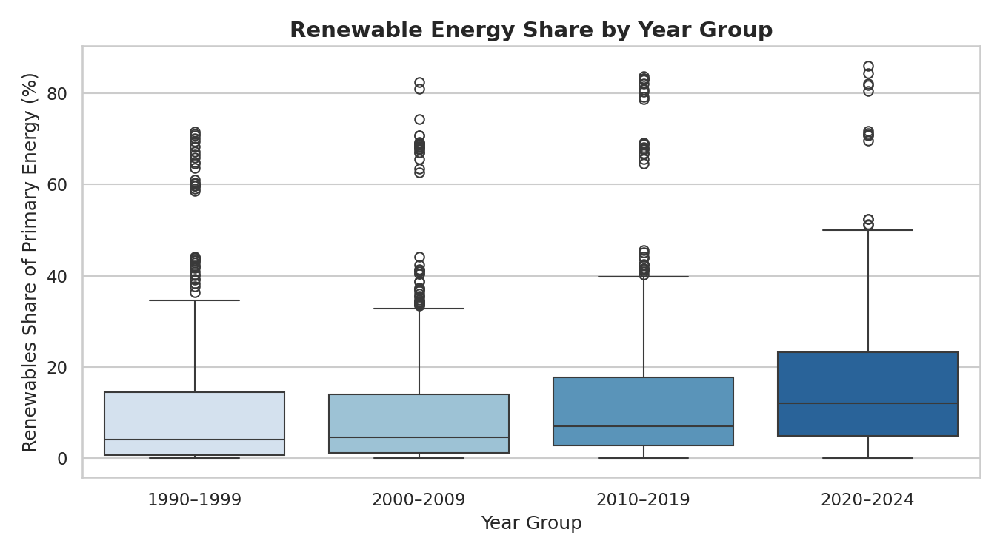
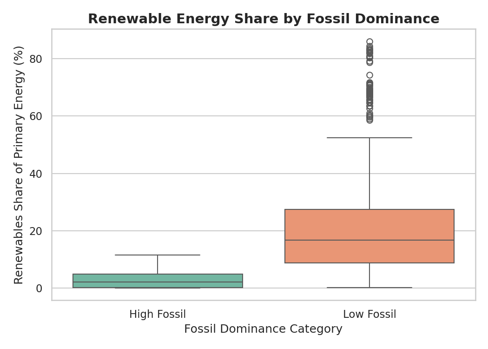
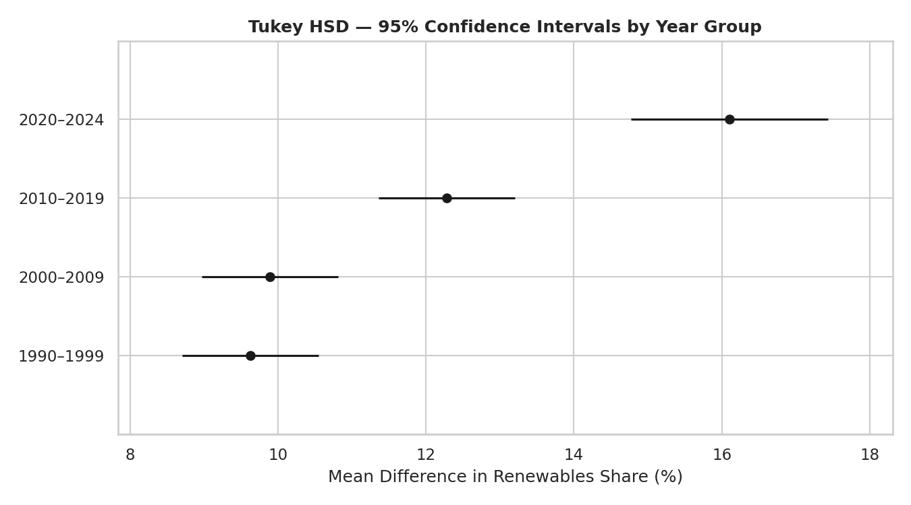
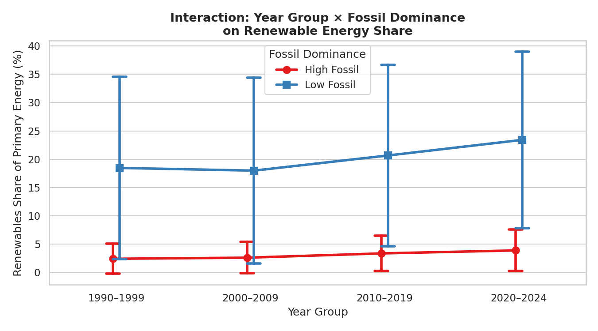
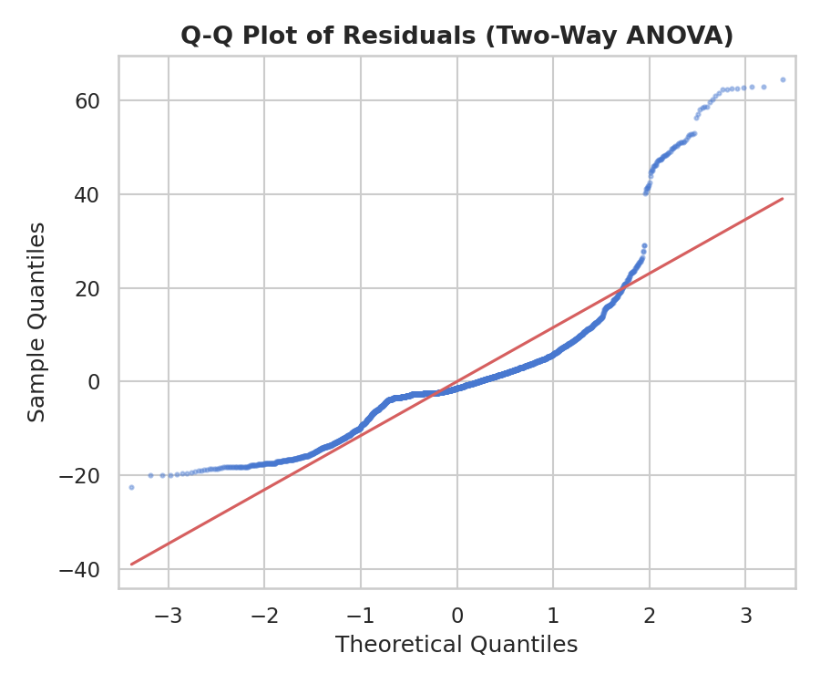
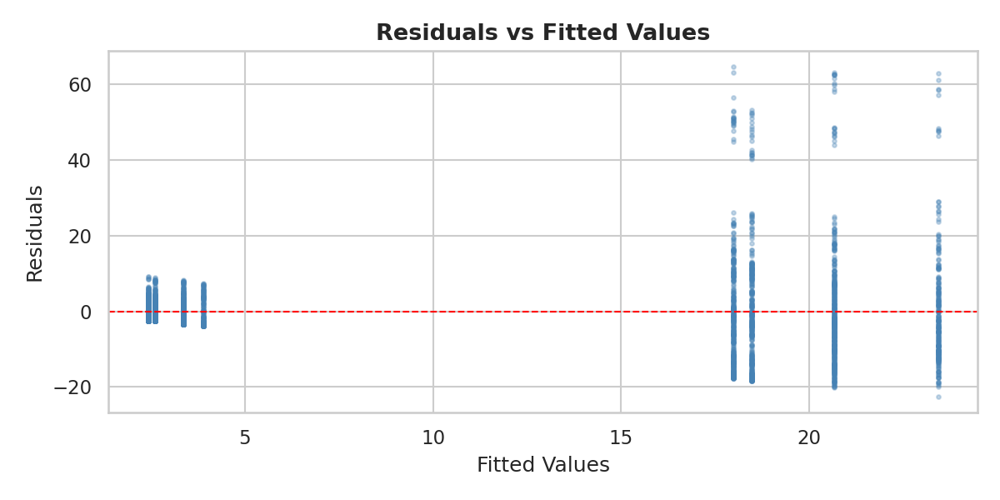

# Lab 3 Report: ANOVA

**Course:** KQC7016 Data Analytics  
**Lab:** Lab 3 - ANOVA (5%)

---

## Chapter 1: Introduction

Analysis of Variance (ANOVA) is a statistical test used to determine whether there are significant differences between the means of three or more independent groups. Rather than running multiple pairwise t-tests (which inflates the Type I error rate), ANOVA tests all groups simultaneously using the F-statistic — the ratio of between-group variance to within-group variance. A large F-statistic and a p-value below the chosen significance level (α = 0.05) indicates that at least one group mean is statistically different from the others.

There are two main forms of ANOVA used in this lab:

- **One-Way ANOVA** — tests the effect of a single categorical factor on a continuous dependent variable.
- **Two-Way ANOVA** — tests the effects of two categorical factors simultaneously, including their interaction. An interaction effect means that the effect of one factor depends on the level of the other.

When the overall ANOVA result is significant, a **post-hoc test** (Tukey's Honest Significant Difference, HSD) is applied to identify exactly which pairs of groups differ.

### Objectives

1. Study the WorldEnergy dataset and identify appropriate columns for ANOVA analysis.
2. Write `lab3.py` to perform both One-Way and Two-Way ANOVA on the dataset.
3. Check the assumptions of ANOVA (normality of residuals, homogeneity of variance).
4. Interpret and discuss the statistical results in the context of global energy trends.

---

## Chapter 2: Methodology

### 2.1 Dataset

The dataset used is **WorldEnergy.csv** sourced from Our World in Data. It contains annual energy statistics for countries worldwide, spanning the years 1900–2024 across 130 columns. The working dataset was filtered to:

- Rows with a valid **ISO country code** — to exclude regional aggregates such as "Africa (EI)" or "ASEAN (Ember)" and retain only actual countries.
- Years **1990–2024** — where renewable energy share data is sufficiently populated for meaningful comparison.
- Rows with non-null values in both `renewables_share_energy` and `fossil_share_energy`.

This yielded **2,765 observations across 79 countries**.

### 2.2 Column and Factor Selection

**Dependent Variable: `renewables_share_energy`**

This column measures the percentage of a country's total primary energy consumption that comes from renewable sources (wind, solar, hydro, biofuel, and other renewables combined). It was chosen because:

- It is a continuous numeric variable, satisfying the fundamental requirement for ANOVA.
- It is the most direct measure of a country's progress in the global energy transition.
- It has sufficient non-null coverage across all year groups compared to other energy columns.
- It is meaningful for policy-relevant questions — whether renewable adoption has changed significantly over decades and whether it differs between fossil-fuel-dependent and less fossil-dependent economies.

**Factor 1: `year_group` (Decade Bins)**

Countries' annual records were grouped into four decade-based categories:

| Year Group | Period |
|---|---|
| 1990–1999 | 1990s |
| 2000–2009 | 2000s |
| 2010–2019 | 2010s |
| 2020–2024 | Early 2020s |

This factor was chosen to test whether the global energy transition has produced statistically significant increases in renewable share across time periods. Grouping by decade reduces year-to-year noise while preserving meaningful temporal structure.

**Factor 2: `fossil_dominance` (High / Low)**

Countries were classified as **High Fossil** (fossil_share_energy > dataset median of 88.4%) or **Low Fossil** (≤ 88.4%). This binary factor was chosen because:

- Countries with very high fossil fuel dependency (e.g., oil and gas exporters) represent a structurally distinct group whose renewable adoption trajectory may differ fundamentally from countries that have historically relied on hydro or other renewables.
- Using the dataset median as the split ensures a balanced partition (~1,382 High Fossil vs 1,383 Low Fossil observations).
- It enables a Two-Way ANOVA to test whether the effect of time on renewable share is the same in both types of economies, i.e., whether a significant interaction exists.

### 2.3 Statistical Tests

| Test | Purpose |
|---|---|
| **One-Way ANOVA** | Test whether mean `renewables_share_energy` differs across the four year groups |
| **Tukey HSD** | Post-hoc: identify which specific decade pairs differ significantly |
| **Two-Way ANOVA** | Test main effects of `year_group` and `fossil_dominance`, plus their interaction |
| **Shapiro-Wilk** | Check normality of residuals |
| **Levene's Test** | Check homogeneity of variance across year groups |

All tests used α = 0.05 as the significance threshold.

### 2.4 Tools and Libraries

```python
pandas          # data loading and manipulation
numpy           # numerical operations
matplotlib      # plot rendering and saving
seaborn         # statistical visualisations
statsmodels     # OLS model fitting and ANOVA tables (anova_lm, typ=2)
scipy.stats     # Shapiro-Wilk and Levene's tests
statsmodels.stats.multicomp  # Tukey HSD post-hoc test
```

---

## Chapter 3: Observations and Results

### 3.1 Descriptive Statistics

The table below summarises `renewables_share_energy` by year group:

| Year Group | Count | Mean (%) | Std (%) | Min | Median | Max |
|---|---|---|---|---|---|---|
| 1990–1999 | 790 | 9.63 | 13.58 | 0.0 | 4.03 | 71.56 |
| 2000–2009 | 790 | 9.89 | 13.81 | 0.0 | 4.45 | 82.49 |
| 2010–2019 | 790 | 12.28 | 14.54 | 0.0 | 6.89 | 83.70 |
| 2020–2024 | 395 | 16.10 | 15.70 | 0.0 | 11.96 | 86.13 |

The mean renewable share shows a clear upward trend: from ~9.6% in the 1990s to ~16.1% in 2020–2024. The standard deviation also increases across periods, suggesting greater spread in adoption rates among countries in recent years — some countries accelerating rapidly while others remain low.

### 3.2 Distribution of Renewable Energy Share



The distribution of `renewables_share_energy` across the entire working dataset is strongly right-skewed. The majority of country-year observations cluster near 0–10%, reflecting that most countries in most years still derive the bulk of their energy from fossil fuels. A long right tail represents countries with high renewable shares (e.g., hydropower-rich nations). This skewness is noted for the assumption checks in Section 3.9.

### 3.3 Boxplot: Renewable Share by Year Group



The boxplot shows that the median and interquartile range of renewable energy share increase progressively from the 1990s to the 2020s. The 2020–2024 group has a visibly higher median (~12%) and a broader IQR compared to earlier decades. The presence of high-value outliers across all groups reflects countries with historically high hydropower use. The 1990s and 2000s distributions appear very similar, which aligns with the Tukey HSD finding that these two groups are not significantly different from each other.

### 3.4 Boxplot: Renewable Share by Fossil Dominance



There is a striking difference between the two fossil dominance categories. **Low Fossil** countries have a median renewable share of approximately 18% with wide spread (IQR spanning roughly 10–27%), reflecting diverse energy mixes. **High Fossil** countries show a very compressed distribution with median near 4% and most values below 12%. This visual separation strongly anticipates the highly significant main effect of `fossil_dominance` in the Two-Way ANOVA.

### 3.5 One-Way ANOVA Result

**Hypothesis:**
- H₀: Mean renewable energy share is equal across all four year groups
- H₁: At least one year group mean is significantly different

**ANOVA Table:**

| Source | Sum of Squares | df | F | p-value |
|---|---|---|---|---|
| year_group | 13,622.67 | 3 | 22.398 | < 0.0001 |
| Residual | 559,754.43 | 2761 | — | — |

**Result:** F(3, 2761) = 22.398, p < 0.0001 → **Reject H₀**

The One-Way ANOVA is highly significant, indicating that year group has a statistically significant effect on the mean renewable energy share. The between-group variation is substantially larger than would be expected by chance alone.

### 3.6 Post-hoc: Tukey HSD



**Tukey HSD Results:**

| Group 1 | Group 2 | Mean Diff (%) | p-adj | Significant? |
|---|---|---|---|---|
| 1990–1999 | 2000–2009 | +0.26 | 0.983 | No |
| 1990–1999 | 2010–2019 | +2.65 | 0.001 | **Yes** |
| 1990–1999 | 2020–2024 | +6.47 | < 0.001 | **Yes** |
| 2000–2009 | 2010–2019 | +2.39 | 0.005 | **Yes** |
| 2000–2009 | 2020–2024 | +6.21 | < 0.001 | **Yes** |
| 2010–2019 | 2020–2024 | +3.82 | < 0.001 | **Yes** |

Five out of six pairwise comparisons are statistically significant. The exception is **1990–1999 vs 2000–2009** (p = 0.983, mean difference only 0.26%), indicating no meaningful change in global average renewable share during that decade. Significant increases began from 2010 onward, with the largest jump occurring between the 2000s and 2020–2024 (mean difference of 6.21 percentage points).

The Tukey HSD confidence interval plot confirms this: the confidence intervals for 1990–1999 and 2000–2009 substantially overlap, while 2020–2024 is clearly separated from all earlier groups.

### 3.7 Interaction Plot: Year Group × Fossil Dominance



The interaction plot displays mean renewable share for High Fossil (red) and Low Fossil (blue) countries across decade groups. Two observations are notable:

1. **The gap between lines is large** — Low Fossil countries consistently have a much higher renewable share (~18–24%) compared to High Fossil countries (~2.5–4%), confirming the strong main effect of `fossil_dominance`.
2. **The lines are not parallel** — Low Fossil countries show a steeper upward trend from 2010 onward, while High Fossil countries remain relatively flat. This non-parallel pattern indicates an **interaction effect**, suggesting that the time-related increase in renewable share has not occurred equally across both categories.

### 3.8 Two-Way ANOVA Result

**Hypotheses:**
- H₀_A: No main effect of year group on renewable share
- H₀_B: No main effect of fossil dominance on renewable share
- H₀_AB: No interaction effect between year group and fossil dominance

**ANOVA Table:**

| Source | Sum of Squares | df | F | p-value |
|---|---|---|---|---|
| year_group | 4,521.58 | 3 | 11.274 | < 0.0001 |
| fossil_dominance | 189,945.77 | 1 | 1420.847 | < 0.0001 |
| year_group × fossil_dominance | 1,239.30 | 3 | 3.090 | 0.0261 |
| Residual | 368,569.36 | 2757 | — | — |

**Results:**
- **Year Group main effect:** F(3, 2757) = 11.274, p < 0.0001 → **Significant**
- **Fossil Dominance main effect:** F(1, 2757) = 1420.847, p < 0.0001 → **Significant** (largest effect by far)
- **Interaction effect:** F(3, 2757) = 3.090, p = 0.026 → **Significant** (p < 0.05)

All three null hypotheses are rejected. The dominant source of variation is `fossil_dominance` (F = 1420.8), which dwarfs the year group effect (F = 11.3). The significant interaction (F = 3.09, p = 0.026) confirms that the trajectory of renewable energy growth over decades differs between High Fossil and Low Fossil countries.

### 3.9 Assumption Checks

#### Normality of Residuals (Shapiro-Wilk)



| Test | Statistic | p-value | Result |
|---|---|---|---|
| Shapiro-Wilk | W = 0.8025 | < 0.0001 | Residuals deviate from normality |

The Shapiro-Wilk test (applied to a random sample of n = 2,765 residuals) returns p < 0.0001, formally rejecting normality. The Q-Q plot confirms this: the points follow the reference line reasonably in the central quantile range but deviate substantially in both tails, indicating heavy-tailed residuals. This is consistent with the right-skewed distribution of the original variable.

However, ANOVA is known to be robust to violations of normality when sample sizes are large (Central Limit Theorem effect). With n = 2,765 observations, the F-statistic distribution remains a reliable approximation, so the conclusions drawn from the ANOVA are still considered valid.

#### Homogeneity of Variance (Levene's Test)



| Test | Statistic | p-value | Result |
|---|---|---|---|
| Levene's Test | W = 5.036 | 0.0018 | Variances are unequal across year groups |

Levene's test is significant (p = 0.0018), indicating that the variance of renewable share differs across decade groups. The Residuals vs Fitted plot also shows a fan-shaped pattern — larger residuals for the higher fitted values (Low Fossil groups), confirming heteroscedasticity. While this is a violation of the homogeneity assumption, ANOVA is moderately robust to this when group sizes are reasonably balanced. These findings are acknowledged as a limitation, and applying Welch's correction or a variance-stabilising transformation (e.g., square root) could be considered for more rigorous analysis.

---

## Chapter 4: Discussion

### 4.1 Why These Data Were Chosen

The choice of `renewables_share_energy` as the dependent variable is motivated by its direct relevance to global energy policy. It is a well-populated, continuous, and meaningful metric for comparing countries' energy structures. Unlike absolute energy production figures, a percentage share normalises for country size and economic scale, enabling fair cross-country comparison.

The `year_group` factor was constructed from the `year` column to enable temporal comparison without treating year as a continuous covariate. ANOVA requires categorical grouping, and decade bins are a natural, interpretable granularity — each decade representing a distinct era of energy policy (pre-Kyoto, post-Kyoto, Paris Agreement era, post-Paris).

The `fossil_dominance` factor was derived from `fossil_share_energy` because structural fossil fuel dependency is a key distinguishing characteristic between countries. Countries above the median (88.4% fossil share) are predominantly oil-exporting or coal-dependent economies; those below include many nations with significant hydro, geothermal, or (more recently) wind and solar capacity. Testing the interaction of these two factors addresses the real-world question: *has the energy transition benefited all countries equally over time?*

### 4.2 Interpretation of One-Way ANOVA

The significant One-Way ANOVA (F = 22.40, p < 0.0001) confirms that global renewable energy share has not been constant across decades — the decade in which a country-year observation falls is a significant predictor of its renewable share. The Tukey HSD results refine this: there was no meaningful progress between the 1990s and 2000s, but from 2010 onward, each decade shows a statistically significant improvement. This aligns with the real-world acceleration of solar and wind deployment that began in the early 2010s, driven by falling technology costs and international policy commitments such as the Paris Agreement (2015).

### 4.3 Interpretation of Two-Way ANOVA

The Two-Way ANOVA reveals that **fossil dominance is the strongest single predictor** of a country's renewable share (F = 1420.8), far exceeding the temporal effect (F = 11.3). Countries with high fossil fuel dependency have maintained consistently low renewable shares regardless of the decade, while Low Fossil countries have higher renewable shares and show a more pronounced upward trend — as evidenced by the non-parallel lines in the interaction plot. The significant interaction (p = 0.026) indicates that the rate of renewable energy growth over decades is not uniform across fossil dominance categories: the energy transition has largely benefited Low Fossil countries, while High Fossil economies have changed comparatively little over the same period.

### 4.4 Assumption Violations and Robustness

Both normality (Shapiro-Wilk p < 0.0001) and homogeneity of variance (Levene's p = 0.0018) assumptions are formally violated. This is partly a consequence of the underlying right-skewed distribution of renewable energy share globally — a variable bounded at zero, with many countries clustered near 0–5% and a minority with very high shares. With n = 2,765 and adequate group sizes, the ANOVA F-test is robust enough that these violations do not invalidate the conclusions. Nonetheless, future analysis could explore a square-root or log transformation of the dependent variable to better satisfy assumptions, or use a non-parametric Kruskal-Wallis test as an alternative to One-Way ANOVA.

---

## Chapter 5: Conclusion

This lab successfully demonstrated the application of ANOVA using the WorldEnergy dataset. A working dataset of 2,765 country-year observations across 79 countries (1990–2024) was constructed, and two ANOVA tests were performed on `renewables_share_energy` as the dependent variable.

The **One-Way ANOVA** confirmed that the decade of observation significantly affects the mean renewable energy share (F = 22.40, p < 0.0001). Post-hoc Tukey HSD identified that meaningful increases in global renewable share began from the 2010s, with the 2020–2024 period showing the highest mean (+6.47 pp above the 1990s baseline).

The **Two-Way ANOVA** further showed that fossil fuel dominance is the dominant factor (F = 1420.85), and a significant interaction (F = 3.09, p = 0.026) exists between decade and fossil dominance — meaning that the upward trend in renewables has not occurred equally across all country types. Low Fossil countries have driven most of the observed renewable growth, while High Fossil countries remain structurally resistant to change.

ANOVA assumption checks indicated violations of normality and homogeneity of variance, which are attributed to the inherently skewed nature of the data. These violations were assessed as non-critical given the large and balanced sample size, but are acknowledged as a limitation.

Key takeaways:

1. ANOVA is an effective tool for testing whether group means differ significantly across categorical factors in a large real-world dataset.
2. Post-hoc Tukey HSD is essential for identifying which specific group pairs drive the overall significant result.
3. The Two-Way ANOVA with interaction reveals nuanced dynamics that a simpler One-Way analysis would miss.
4. Assumption checking (Shapiro-Wilk, Levene's, Q-Q plot, residual plot) is a critical step in validating ANOVA results and contextualising their reliability.

---

**GitHub Link:** [KQC7016-Data-Analytics](https://github.com/amru231/KQC7016-Data-Analytics)
