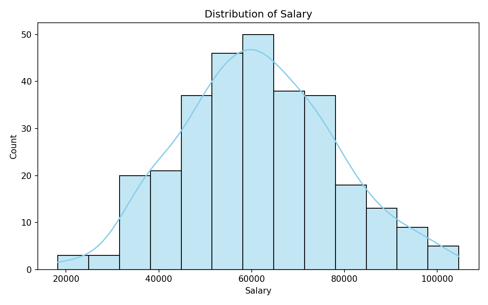
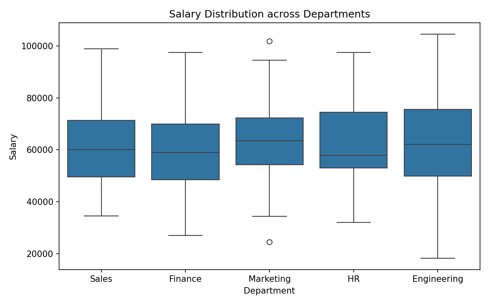
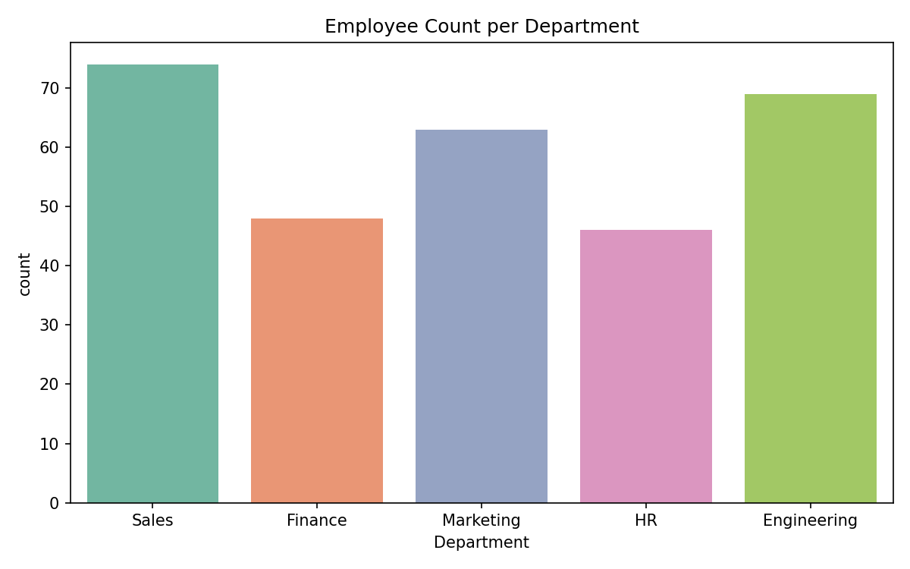
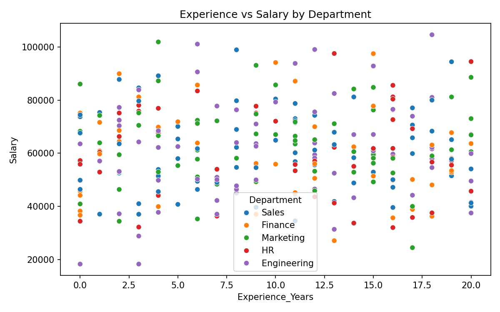
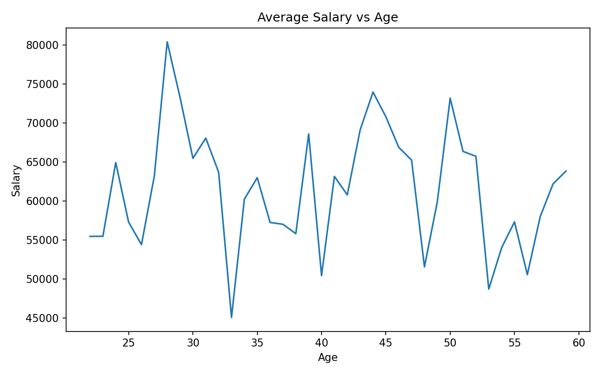
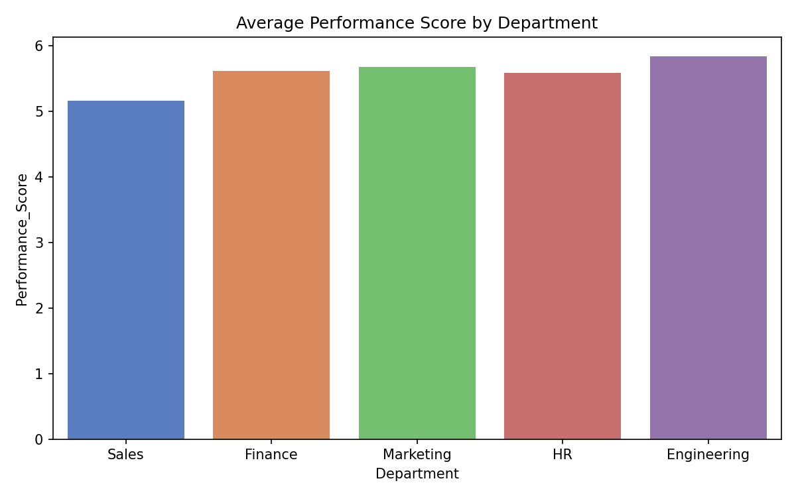
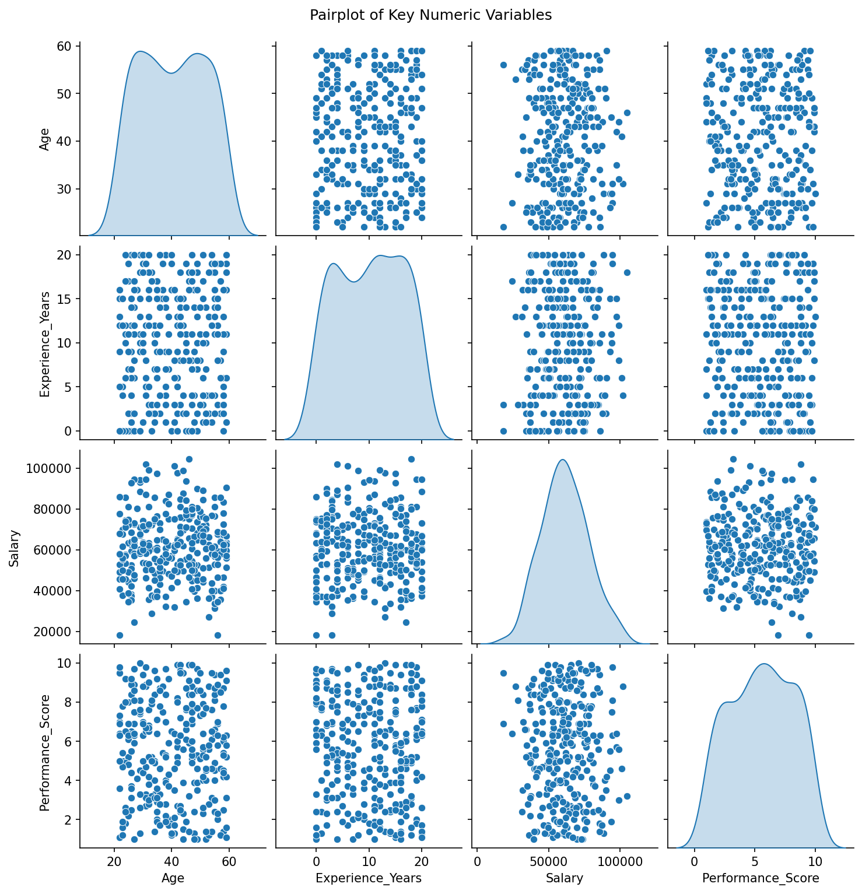
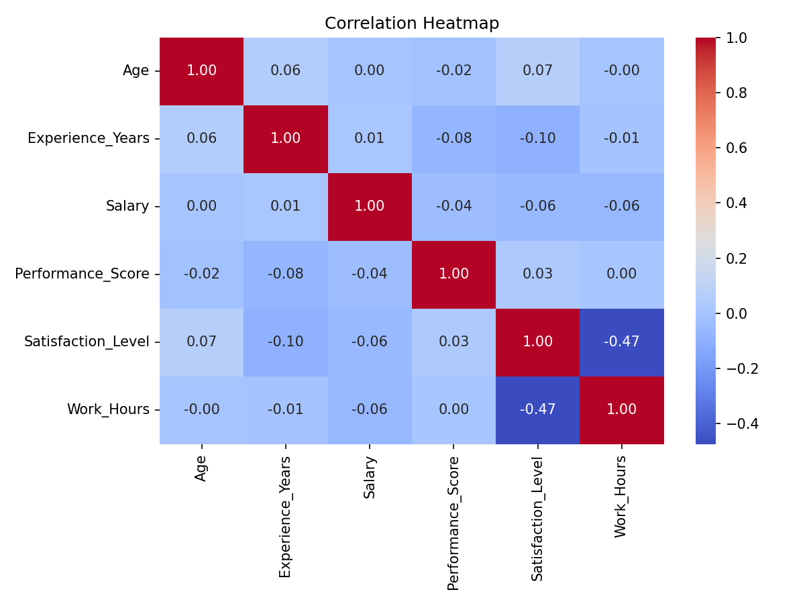
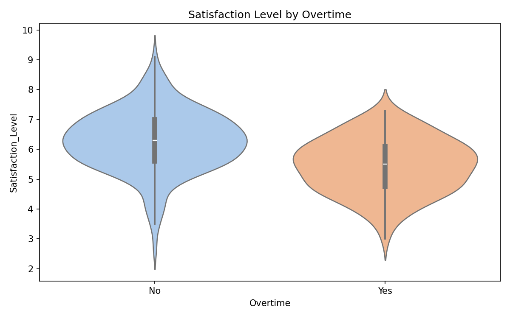

# EDA Visualization — Plot Interpretations

## 1. Univariate Visualizations

### Distribution of Salary (Histogram with KDE)

The salary distribution follows a **Normal (Gaussian) distribution**, as shown by the bell-shaped histogram and the smooth KDE curve overlaid on it. The centre of the distribution represents the mean salary, which is approximately **60,000**. Most employees earn salaries clustered around this central value, with frequencies tapering off symmetrically towards both extremes (the lowest salary being around 18,000 and the highest around 105,000).

### Salary Distribution across Departments (Boxplot)

The boxplot shows the salary distribution for each department, where the **line inside each box represents the median**, the **box itself represents the interquartile range (IQR)** (i.e., the middle 50% of salaries), and the **whiskers represent the full range** of data excluding outliers. Key observations:

- **Marketing** has two **outliers** (the circles above and below the whiskers), indicating a few employees with unusually high or low salaries compared to the rest of the department.
- **HR** has the **lowest median** salary compared to all other departments.
- **Engineering** has the **widest range** (longest whiskers), meaning salary variation is greatest in this department — from the lowest (~18,000) to the highest (~105,000) in the entire dataset.

### Employee Count per Department (Countplot)

This is a straightforward bar chart showing the number of employees in each department. Sales has the most employees (74), followed by Engineering (69), Marketing (63), Finance (48), and HR (46). There is nothing particularly surprising here — it simply shows the headcount distribution across departments.

---

## 2. Bivariate Visualizations

### Experience vs Salary by Department (Scatterplot)

At first glance, years of experience and salary appear **irrelevant to each other** — there is no visible linear trend across the overall data. When focusing on individual departments (e.g., Engineering shown in purple), there is still **no linear relationship** between experience and salary within that group. The data points are scattered widely across all salary levels regardless of experience years.

This **disproves the common assumption** that years of experience is linearly proportional to salary. In this dataset, experience alone does not predict salary — other factors (department, role, negotiation, etc.) likely play a bigger role.

### Average Salary vs Age (Lineplot)

The line fluctuates erratically without any consistent upward or downward trend, confirming that age alone is not a reliable predictor of salary. One notable observation is that the **lowest average salary occurs around age 33–34**, dipping to approximately 45,000. Assumptions can be made about why (e.g., employees in that age range may disproportionately belong to lower-paying departments like HR, based on the earlier boxplot finding), but the actual reason is unknown from the data alone. Overall, **not much actionable insight can be drawn from this plot**.

### Average Performance Score by Department (Barplot)

The average performance scores across all departments are very similar (ranging from approximately 5.2 to 5.8), with no single department standing out significantly. There is nothing particularly noteworthy here — performance appears roughly uniform across the organisation.

---

## 3. Multivariate Visualizations

### Pairplot (Age, Experience, Salary, Performance Score)

The pairplot displays scatterplots for every pair of variables and KDE distributions along the diagonal. Key observations:

- **Age and Experience_Years** appear **uncorrelated** — the scatterplot shows data scattered in all directions with no discernible pattern. A young employee can have many years of experience and vice versa.
- **Age and Salary** show **no meaningful correlation** — salary is spread widely across all ages.
- **All other variable pairs** (Salary vs Performance_Score, Experience vs Performance_Score, etc.) also show **no visual correlation** — the distributions are scattered all over the place.

In summary, none of the four variables show strong pairwise relationships with each other based on visual inspection.

### Correlation Heatmap

The heatmap quantifies the linear relationships between numeric variables using Pearson correlation coefficients:

- **Same variables** naturally have a perfect correlation of **1.00** (diagonal).
- **Work_Hours and Satisfaction_Level** have a notable **negative correlation of -0.47**, meaning employees who work more hours tend to have lower satisfaction levels. This is the strongest relationship in the heatmap.
- **Age and Experience_Years** have a **weak positive correlation of 0.06**, which is essentially negligible — contrary to what one might expect, older employees do not necessarily have more experience in this dataset.
- All other variable pairs have **near-zero correlations**, confirming that Salary, Performance_Score, and the remaining variables are largely independent of each other.

### Satisfaction Level by Overtime (Violin Plot)

The violin plot compares the distribution of satisfaction levels between employees who work overtime and those who do not. Employees with **no overtime** have a **higher median satisfaction level** (~6.3 vs ~5.5) and their distribution is concentrated in the upper range (6–8). Employees with **overtime** have a lower and more spread-out distribution, with satisfaction levels skewed towards 4–6. This intuitively makes sense — employees who do not work overtime are naturally more satisfied with their work-life balance.
